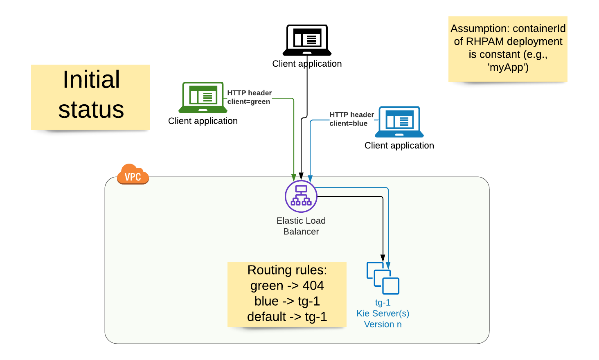
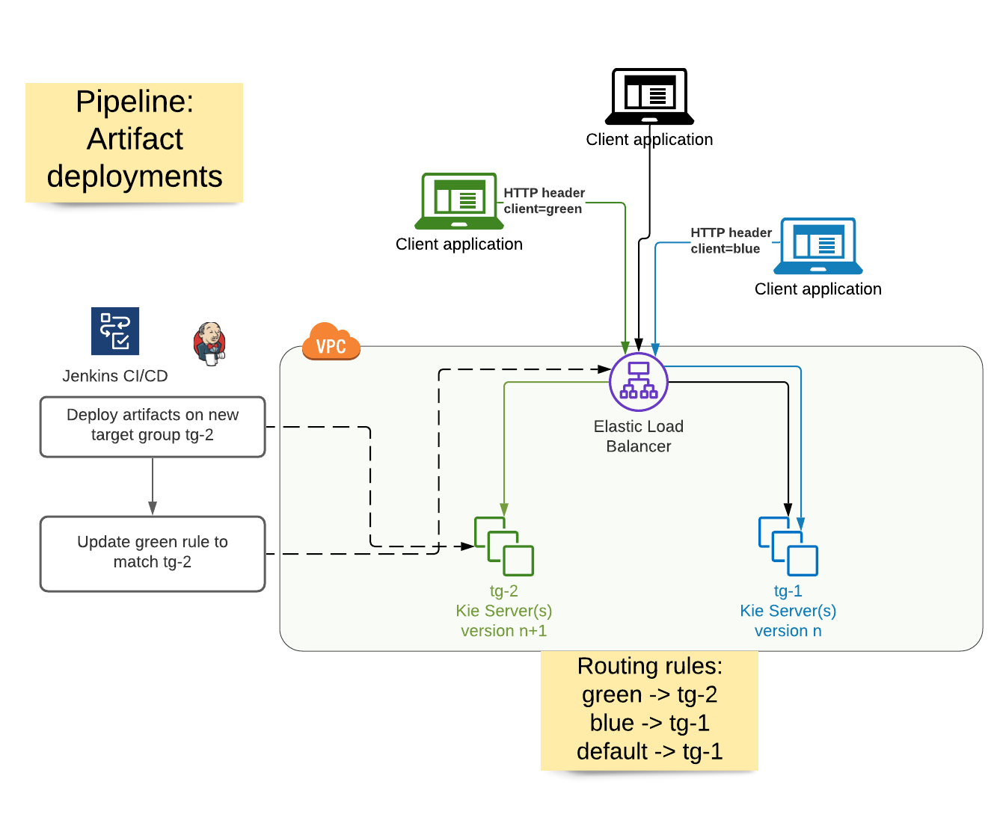
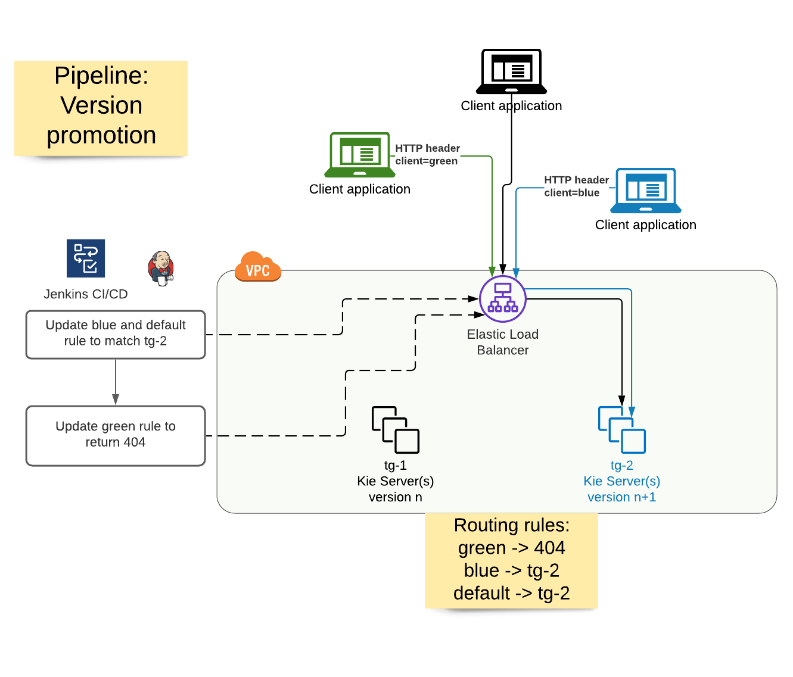
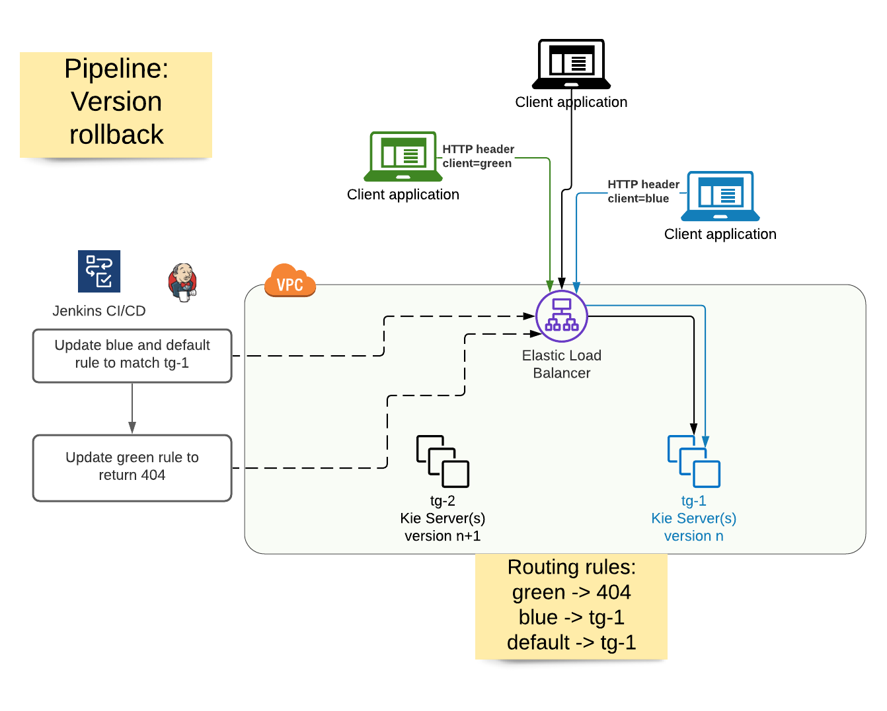

> # ⚠️ **Draft version**

# Near zero downtime deployments
## Purpose
Main goal is to update the deployments in Kie Server, in the production environment, with a **near zero downtime** deployment
Optionally, we can define a [Canary deployment](https://wa.aws.amazon.com/wellarchitected/2020-07-02T19-33-23/wat.concept.canary-deployment.en.html)
with `blue` and `green` workflows to provide rollback capability

Rationale behind this pattern:
>The fundamental idea behind blue/green deployment is to shift traffic
between two identical environments that are running different versions of your
application. <br/>
>The blue environment represents the current application version serving
production traffic. In parallel, the green environment is staged running a different version
of your application. <br/>
>After the green environment is ready and tested, production traffic is
redirected from blue to green. <br/>
> If any problems are identified, you can roll back by
reverting traffic back to the blue environment.

Configurations related to this latter aspect are marked with an (Optional) comment.

## Working assumption
The deployment uses a fixed, unversioned `containerId` to identify itself, like in the following example:
```json
{
    "container-id": "app",
    "release-id": {
        "group-id": "com.myspace",
        "artifact-id": "app",
        "version": "2.0.0-SNAPSHOT"
    }
}
```

This assumption is mandatory to:
* Avoid client updates after every new deployment in the Kie Server
* Immediately switch the client traffic on the new deployment as soon as it is available 

**Note**: if the client path is updated to match the new artifact version, this pattern can still be applied with the following 
caveats:
* The client must update it's HTTP requests to declare what type of deployments it refers to (e.g., using an HTTP header, see below)
* The deployment infrastructure must notify the clients after each new deployment

## Deployment flow
### Initial scenario
* Kie Servers with version `n` of the artifacts, under Target Group `tg-n` (associated to Auto Scaling Group `asg-n`)
  * This is the latest, stable production application, the `blue` path
* Kie Server's Application Load Balancer `alb-ks` has rules:
  * default forward rule to map to `tg-n`
  * (Optional) rule mapped to HTTP header `x-client-mode=blue` to map to `tg-n`
  * (Optional) rule mapped to HTTP header `x-client-mode=green` to map to HTTP status code 404



### Artifacts deployment
Steps performed by `deployment` CI/CD pipeline:
* New Auto Scaling Group `asg-(n+1)` is created, with Target Group `tg-(n+1)`
  * Capacity definition is copied from current `asg-n` configuration or has some default settings
* **When all the configured servers are ready**:
  * Routing rules are updated in `alb-ks`:
    * (Optional) HTTP Header `x-client-mode=green` maps to `tg-(n+1)`
    * (Optional) HTTP Header `x-client-mode=blue` maps to `tg-n`
    * Default rule maps to `tg-n`



In case of Canary deployment, we may have clients validating the latest version (beta testing) and clients remaining on the
previous version.

Otherwise, all the client requests are routed to the new set of servers running the latest version (implicit promotion of 
new version, see next step).

Since the new servers are connected to the Application Load Balancer `alb-ks` only when they are ready to serve new requests,
the switch of the client traffic will not be impacted by any downtime.

### (Optional) Version promotion
In case of Canary deployment, it is performed with ad-hoc Jenkins pipeline:
* Routing rules are updated in `alb-ks`:
  * (Optional) HTTP Header `x-client-mode=green` maps to HTTP status code 404
  * (Optional) HTTP Header `x-client-mode=blue` maps to `tg-(n+1)`
  * Default rule maps to `tg-(n+1)`
  * Servers in `tg-n` can be either terminated or moved to standby mode to provide rollback capability



According to this deployment, we can have only clients using the latest version. `green` clients would receive error response.

### (Optional) Version rollback
In case of Canary deployment, it is performed with ad-hoc Jenkins pipeline:
* Routing rules are updated in `alb-ks`:
  * (Optional) HTTP Header `x-client-mode=green` maps to HTTP status code 404
  * (Optional) HTTP Header `x-client-mode=blue` maps to `tg-n`
  * Default rule maps to `tg-n`
  * Servers in `tg(n+1)` can be terminated or used for debugging purposes  



According to this deployment, we can have only clients using the previous version. `green` clients would receive error response.

## Possible extensions
* Reuse fixed set of Auto Scaling Groups `asg-1` and `asg-2` and just create new Target Groups
* In the simplest scenario, we could just add the new Target Group to the existing, single Auto Scaling Group, and terminate
one by one the previous instances (termination policy configured to "Oldest instance"), but this would prevent having 
the rollback capability

## Security constraints
* CI/CD pipeline needs permissions to manage the Auto Scaling Group, create Target Groups and manipulate the 
listener rules of the Application Load Balancer

## Evaluating listener rule conditions
Other conditions are available for the listener rules of the Application Load Balancer, but only the HTTP header match condition
seems to fit our needs:
* HTTP header
  * Works in the assumption of a constant `containerId`
  * Does not need any update on the client side
* Host header
  * Similar to HTTP header, just less flexible: the value must be a URL (e.g. "www.acme.com")
* Path
  * Requires to identify the proper Target Group from the URL path
  * Some requests do not include the `containerId`, they would fall into the `default` rule, which might forward it to 
  the wrong Target Group 
* HTTP request method
  * Undoable, as both Target Groups are exposing the same services with same methods
* Query string
  * Requires to identify the proper Target Group from the URL query parameters
  * Some requests do not include any query parameter, they would fall into the `default` rule, which might forward it to
  the wrong Target Group
* Source IP:
  * Needs to know in advance the client IP addresses
