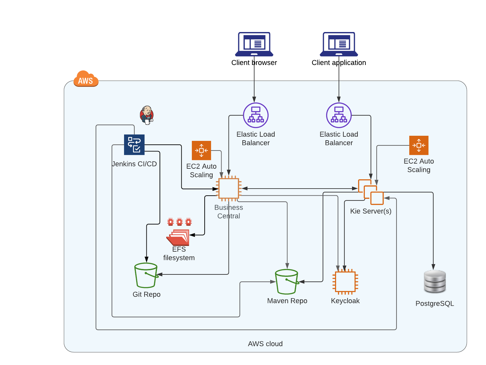

# RHPAM deployments on AWS
The reference architecture includes a distributed network of the following services:
* Maven repository
* PostgreSQL database
* Git server
* Jenkins CI/CD
* Keycloak authentication server
* One or more RHPAM Kie Servers, under an Application Load Balancer and managed by an Auto Scaling Group
  * The RHPAM Business Central is configured with a mounted EFS filesystem to restore the server status in case
  of server failure
* One RHPAM Business Central, under an Application Load Balancer and managed by an Auto Scaling Group (with capacity of 1 instance)
* EFS filesystem mounted on the RHPAM Business Central VM

The following diagram describes the main interactions in the system:


**Note**: for simplicity, in the above architecture we omitted other resources such as the
Load Balancers that manage the traffic directed to the exposed subsystems like Keycloak and the Maven repository

## Definitions
- `Development` environment: a runtime environment where the RHPAM Kie Server runs in `managed` and `mutable` mode
  - The RHPAM Kie Server is controlled by the Business Central
  - Updated artifacts are deployed through the CI/CD pipeline on all the running RHPAM Kie Servers
- `Production` environment: a runtime environment where the RHPAM Kie Server runs in `unmanaged` and `immutable` mode
  - No Business Central is deployed in this environment
  - The RHPAM Kie Server is launched from an immutable AMI image that includes the application artifacts
  - Updated artifacts are deployed through the CI/CD pipeline to create an updated runtime image
    - Running servers are replaced by new servers based on the new images

## Scope definition
The purpose of this activity is to define an automated procedure and the manual steps to define a CI/CD pipeline for both 
the `Development` and `Production` environments, where the CI/CD pipelines updates the deployed artifacts on all the 
servers and guarantee that they are running the same version at any time.

The procedure is targeted to install and configure:
- The RHPAM Business Central
- The RHPAM Kie Server

Manual procedures are also given to configure the connected subsystems:
- The Maven repository
- The Git server
- The Keycloak authentication realm
- The Jenkins server

The target version of the installed components is:
* RHPAM Business Central (v. 7.9.1)
* RHPAM Kie Server (v. 7.9.1)
* Keycloak (v. 12.0.2)

**Note**: the provisioning of the initial AWS infrastructure is out of scope

**Note**: the configuration of the security certificates is out of scope

**Note**: the provisioning of the connected subsystems is out of scope

**Note**: the pipeline is designed to deploy and update a single artifact on the running servers, managing
multiple artifacts is out of scope

## Deployment flow
Starting from the empty reference AWS architecture (e.g., no RHPAM deployments are configured on the assigned EC2 servers), 
the deployment follows these manual [M] and automated steps [A]:
- [M] Configure the Keycloak realm
- [M] Configure the Maven repository
- [A] Configure the PostgreSQL DB
- [A] Deployment of RHPAM Business Central  on the assigned EC2 VM (only `Development` environment)
- [M] Configure the Git connectivity
- [A] Deployment of RHPAM Kie Server on the assigned EC2 VM
- [M] Generate the required AMI images
- [M] Update the Launch Configuration of the Auto Scaling Groups to match the new AMI ids
- [M] Configure the Jenkins server and the CI/CD pipeline

### Configure the Keycloak realm
RHPAM servers need the following resources in a new Keycloak realm:
- `rest-all`, `admin` and `kie-server` roles
- An RHPAM admin user with roles `rest-all`, `admin` and `kie-server` and the `realm-admin`
role for the `realm-management` client
- A user to connect Kie Server to Business Central, with `rest-all` role (must match with `rhpamController_username` and
  `rhpamController_password` in Kie Server [runtime.properties](./runtime/kie-server/runtime.properties)) 
- A user to connect Business Central to Kie Server , with `kie-server` role (must match with `KIESERVER_USERNAME` and
`KIESERVER_PASSWORD` in Business Central [runtime.properties](./runtime/business-central/runtime.properties))
- A `business-central` client with `confidential` access-type and managing redirect URIs coming 
from the Business Central's Load Balancer (both HTTP and HTTPS protocols)
- A `kie-server` client with `confidential` access-type and managing redirect URIs coming 
from the Kie Server's Load Balancer (both HTTP and HTTPS protocols)

#### Configure the Maven repository
The Maven repository must be configured with one repository to store SNAPSHOT and RELEASE artifacts.
The repository location is used in both Business Central and Kie Server deployments.

Detailed instructions for `Sonatype Nexus Repository Manager`:
* Login with a user with `nx-admin` role
* Create a repository called `rhpam` of type `maven2/hosted` with policy `Mixed`

##### Configure distributionManagement in RHPAM projects
In order to deploy a RHPAM project on the configured Maven repository, the project `pom.xml` must
include the following declaration:
```xml
<distributionManagement>
  <repository>
    <id>rhpam</id>
    <url><MAVEN_REPOSITORY_URL></url>
  </repository>
</distributionManagement>
```

### Configure the PostgreSQL DB
The database is created and initialized during the initial configuration of the KIE Server, using
the connection properties defined in the Kie Server [runtime.properties](./runtime/kie-server/runtime.properties)

### Deployment of RHPAM Business Central and Kie Server
#### Software requirements
* To run the deployment procedure you need a Linux workstation with `bash` shell and the following software:  
  * `zip`
  * `unzip`
* The updated content of the current repository must be cloned on the same workstation.
* Place the required software artifacts under the `eap/rhpam-on-aws-automation-postgresql/installer` folder of the repository,
in the expected sub-folders:
  * `jboss-eap` folder
    * [jboss-eap-7.3.0-installer.jar][jboss-eap-installer]
      * [jboss-eap-7.3.6-patch.zip][jboss-eap-patch]
      * [keycloak-oidc-wildfly-adapter-12.0.4.zip][keycloak-adapter]
        * It is in the "Client Adapters" section of the download page, in the row for "JBoss EAP" version 7 (zip format)
  * `rhpam` folder
    * [rhpam-installer-7.9.1.jar][rhpam-installer]
  * `database` folder (create it if missing)
    * [rhpam-7.9.1-add-ons.zip][rhpam-add-ons]
#### Preparing SSH Tunnel (optional)
In case the actual VM is reached through an SSH Tunnel, you can create the tunnel by running the provided utility
[ssh-tunnel.sh](./lib/ssh-tunnel.sh) as follows:
```shell
lib/ssh-tunnel.sh -t <TUNNEL_HOST> -s <REMOTE_HOST.pem> -u <TUNNEL_USER> -r <REMOTE_HOST> -l <LOCAL_PORT>
```
This creates a tunnel to the remote host `<REMOTE_HOST>` passing through host `<TUNNEL_HOST>` at local port `<LOCAL_PORT>`.
`<TUNNEL_USER>` user is used to connect the tunnel host, while the `<REMOTE_HOST.pem>` certificate is used for authentication. 

You can test the tunnel by connecting as:
```shell
ssh -i  <REMOTE_HOST.pem> -p <LOCAL_PORT> <REMOTE_USER>@localhost
```
Note that `<TUNNEL_USER>` and `<REMOTE_USER>` might actually be different users.

#### Install and configure RHPAM services
The installation steps are performed with the [installer.sh](./installer.sh) script that is configured with the properties
defined in [installer.properties](./installer.properties) 

##### Install RHPAM Business Central
Set the following in [installer.properties](./installer.properties):
* `RHPAM_SERVER`: must be `business-central`

Then, update all the runtime properties in [runtime.properties](./runtime/business-central/runtime.properties) to connect to the
actual Keycloak instance, then run it as:
```shell
./installer.sh
```

##### Install RHPAM Kie Server
Set the following in [installer.properties](./installer.properties):
* `RHPAM_SERVER`: must be `kie-server`
* `KIE_SERVER_TYPE`: either `managed` or `unmanaged`

Then, update all the runtime properties defined in [runtime.properties](./runtime/kie-server/runtime.properties) to connect to the
actual Keycloak and PostgresQL instances, then run it as:
```shell
./installer.sh
```

##### Testing the deployment
A [functional checklist](./test/functional-checklist.md) procedure is provided to validate the deployment.

### Configure the Git connectivity
#### Business Central server setup
The following steps are needed to define the SSH connection between the Business Central VM and the 
remote Git server.

Generate an SSH key for the `root` user using the PEM format, as in the following example:
`ssh-keygen -t rsa -b 4096 -C "bci@redhat" -m PEM`

For the `root` user, add to `~/.ssh/config` the reference to the key to use when dealing with the Git server.
For example, if `1.2.3.4` is the Git server IP address and `id_rsa` is the name of the Key:
```
Host 1.2.3.4
IdentityFile /root/.ssh/id_rsa
```
#### Git server setup
Added the public key  defined in the previous step in the `~/.ssh/authorized_keys` file of the Git VM for the `git` user.

#### Define per-project post-commit hook
Follow these steps to configure a post-commit hook in a single RHPAM project to automatically push the 
changes to the remote repository:
```shell
cd  <EFS_MOUNT_POINT>/.niogit/<SPACE>/<PROJECT_NAME>.git/hooks
echo '#!/bin/sh
git push origin +master' > post-commit
chmod 744 post-commit
```
The procedure must be repeated for all the projects requiring automatic sync between the local and remote
Git repositories.

**Note**: the assumption is that the project was initially imported in Business Central using the
`Import Project` function

### Generate the required AMI images
Use the AWS console to generate the base images from the RHPAM Business Central and Kie Server EC2 VMs.

**Preliminary steps**:
* Remove any deployed artifact from the RHPAM Kie Server so they're not saved in the base image

### Update the Launch Configuration of the Auto Scaling Groups to match the new AMI ids
Use the AWS console to generate a new Launch Configuration for RHPAM Business Central and RHPAM Kie
Server using the newly generated AMI images, and connect them to the Auto Scaling Groups, replacing the
original one.

### Configure the Jenkins server and the CI/CD pipeline
Instructions are provided in a separate [README.md](./jenkins/README.md)

## Additional Notes
### EC2 VM tags required by the Jenkins pipeline
The reference pipeline implementation lookups the RHPAM server instances by querying by tag the AWS network. The following  
required tags must be then configured on the EC2 VM instances:
* Kie Server: app=RHPAM-KS
* Business Central: app=RHPAM-BC

### Isolate Development and Production environments
For the sake of keeping these environments as much isolated as possible, the recommendation is to apply a different
configuration for:
* The Keycloak realm
  * Create one for each runtime environment with a different name
  * Create realm users with different names and passwords
* The DB schema: create one for each runtime environment with a different name

### Authenticated services under the Application Load Balancer 
It is a recommended good practice to expose only secured endpoints to the service consumers outside the AWS network,
and this can be achieved with the following configurations:
* Create a `Forward rule` in the Load Balancer to map all the HTTPS requests at port 443 to the HTTP port 8080 of the associated 
RHPAM service
* Create a `Redirect rule` in the Load Balancer to map all the HTTP requests at port 80 to the HTTPS port 443 of the same Load Balancer

### Define application endpoints in client apps
According to the reference architecture, whenever the CI/CD pipeline deploys a new version of the artifacts, the client
application needs to update the service endpoint URIs, since they might include the versioning information
in their path, as in the following API to start a given task by ID:
```
PUT {{scheme}}://{{kieserver-url}}/services/rest/server/containers/{{containerId}}/tasks/{{taskInstanceId}}/states/started?user=rhpamadmin
```

### Updating server properties
The `runtime.properties` files of the RHPAM services can be updated to reflect any change in the connected system 
(e.g., it may be needed if we regenerate the Keycloak secret of the realm clients). After the change, the server(s)
must be restarted, either by restarting the entire VM(s) or the specific Linux services (requires SSH connection).

While the `runtime.properties` of the RHPAM Business Central is stored in the mounted EFS filesystem and shared by all 
the running instances, the RHPAM Kie Server properties are stored in the local filesystem of each EC2 VM, so multiple
changes might be needed.

The recommendation is to adopt a similar pattern to externalize the configuration in a shared location, like:
* EFS filesystem
* S3 bucket
* AWS Parameter Store
This way, a single change would affect all the running instances. Service restart would be needed in any case.

### Application rollouts and service availability  
The execution of the CI/CD pipelines, for both the runtime environments, might imply a temporary unavailability of
the services, because the original artifacts (or VMs, in case of `Production` environment) are deactivated
before activating the updated artifacts.

Considering that the client application might also need to be updated, and the limitations of the Application Load Balancer, 
that just acts as a Reverse Proxy and is unable to work as a Service Router to forward specific requests to
the available servers, a planned maintenance period is recommended before any version upgrade.

### Interruption of the CI/CD pipeline 
The CI/CD pipeline execution will be interrupted if any active process is currently instantiated: the RHPAM Kie Server prevents
the upgrade of an application in such cases.

A proper error message will be displayed when this happens.

### Auto scaling Kie Server in Development environment
In the Development environment, the RHPAM Kie Server runs from an image with no initial deployments: the deployment is
updated immediately after the first launch of the server, by using the `user-data` information injected into the EC2 VM from
the associated Launch Configuration.

This information is updated by the CI/CD pipeline and holds the artifact configuration using the well-known Maven
GAV format: Group-Artifact-Version.

## Deploying artifacts from Business Central
The working assumption for the reference architecture is that all the running Kie Servers always have the same deployments: if this is not the case,
e.g. if any user changes the deployments on any server from the Business Central console, the Load Balancer of the Kie Server might 
forward an unmanaged request to one of the available servers, throwing back an error response to the client.

Please consider using the RHPAM Smart Router as an option to by-pass this problem. 

<!-- links -->
[jboss-eap-installer]: https://access.redhat.com/jbossnetwork/restricted/listSoftware.html?downloadType=distributions&product=appplatform&version=7.3
[jboss-eap-patch]: https://access.redhat.com/jbossnetwork/restricted/listSoftware.html?product=appplatform&downloadType=patches&version=7.3
[keycloak-adapter]: https://www.keycloak.org/archive/downloads-12.0.4.html
[rhpam-installer]: https://access.redhat.com/jbossnetwork/restricted/listSoftware.html?downloadType=distributions&product=rhpam&version=7.09.1
[rhpam-add-ons]: https://access.redhat.com/jbossnetwork/restricted/listSoftware.html?downloadType=distributions&product=rhpam&version=7.09.1
