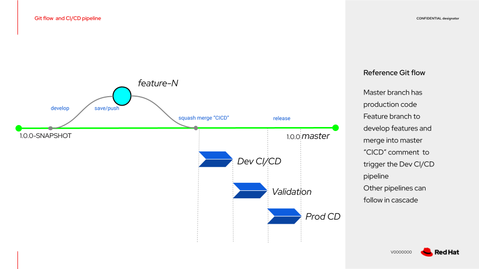
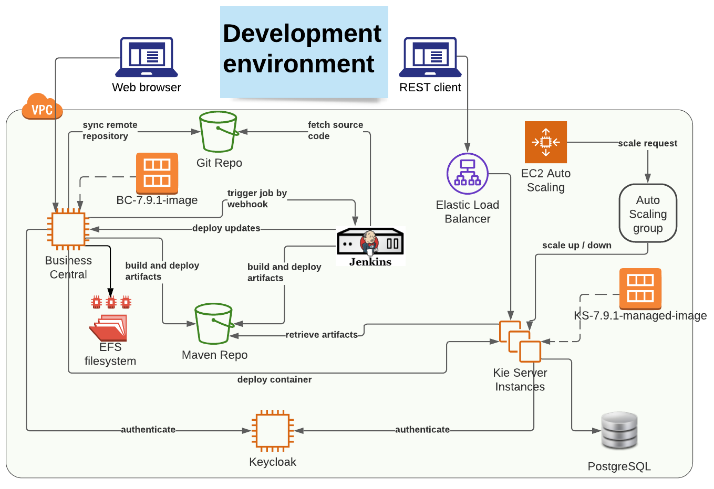

# Demo of development environment pipeline
Showing a real use case development flow and how this triggers the development pipeline to deploy the project artifact
on the RHPAM Kie Server(s).

* Reference git flow
  * Master branch has production code
  * Feature branch to develop features and merge into master
  * `CICD` comment  to trigger the Dev CI/CD pipeline
  * Other pipelines can follow in cascade


* Authoring environment
  * “A developer can push artifacts from business central to a kie server”
  * EFS to provide data recovery
  * Git hooks in place to sync a remote Git repository


* Development environment
  * When the user saves a workflow, then the artifacts are stored in Maven
  * Any artifacts are loaded to the target Kie servers from the Maven Repo
  * It can share the RHPAM servers with Authoring environment (mutually exclusive access to the servers)


* Production environment
  * Running unmanaged, immutable servers


## Setup git repository
**git VM**: create empty `demo` repository
```shell
sudo su
su - git
cd /home/git/
mkdir demo.git
cd demo.git
git init --bare
```

## Create project on Business Central VM
**Business Central VM**
* Create `Demo` space
* Create `demo` project
* Update origin of project repository
```shell
sudo su
cd /root/efs-mount-point/.niogit/Demo/demo.git
git remote add origin git@GIT_SERVER_IP:/home/git/demo.git
git remote -v
```

## Configure post-commit hook
**Business Central VM**: 
* Check origin of project repository
```shell
cd /root/efs-mount-point/.niogit/Demo/demo.git

echo '#!/bin/sh
branches="$(git branch | colrm 1 2 | awk '"'"'{print $1}'"'"')"

for branch in $branches; do
    source="$branch"
    target="$branch"
    echo "PUSHING TO BRANCH [$source:$target]"
    git push -u origin "$source":"$target"
done' > hooks/post-commit
chmod 744 hooks/post-commit
```
This is needed to sync the local and the remote git

* Clone the project to verify the changes are synced on the remote git
```shell
cd /tmp
git clone git@GIT_SERVER_IP:/home/git/demo.git
cd demo
git remote -v
```
* Apply changes on `master` branch: create `main` Business Process
* Verify on cloned repository
```shell
cd /tmp/demo
git pull 
find src
```
## Configure pre-push hook
```shell
cd /root/efs-mount-point/.niogit/Demo/demo.git
echo 'read local_ref local_sha remote_ref remote_sha
date >> /tmp/pre-push-log.out
SQUASH_INDICATION=$(git show "$local_sha" | grep -i CICD)
# Only if commit message contains CICD(not case sensitive) then invoke jenkins pipeline.
if [[ -n "${SQUASH_INDICATION}" ]]; then
    echo "waiting 2 seconds before invoking jenkins pipeline..." >> /tmp/pre-push-log.out
    bash -c "sleep 2 \
     ; curl -X GET --user USERNAME:PASSWORD https://JENKINS_SERVER_URL/job/build-artifact/buildWithParameters?token=deploy-artifact-temenos >> /tmp/pre-push-log.out" &

    echo "jenkins invoked successfully" >> /tmp/pre-push-log.out
    echo "ending pre-push hook script, on time:" >> /tmp/pre-push-log.out
    date >> /tmp/pre-push-log.out
fi
exit 0' > hooks/pre-push
chmod 744 hooks/pre-push
```
This is needed to trigger the pipeline when a commit comment includes the `CICD` word

## Application development
* Add `<distributionTag>` to `pom.xml`
```xml
<distributionManagement>
    <repository>
        <id>rhpam</id>
        <url>https://redhat-repo.dev-temenos-cloud.net/repository/rhpam</url>
    </repository>
</distributionManagement>
```
This is needed to define the repository of the Maven artifacts

* Run `Build&Install` and check the remote Maven repository
* Run `Deploy`, create the process instance and check the hello message
* Create branch `feature1` and update the hello message
* Submit `Change Request` and include `CICD` word to the comment
* Verify the Jenkins pipeline runs 
* Verify the remote Maven repository includes the latest artifacts
* Verify the server deployment is updated (create new process and check the hello message)
