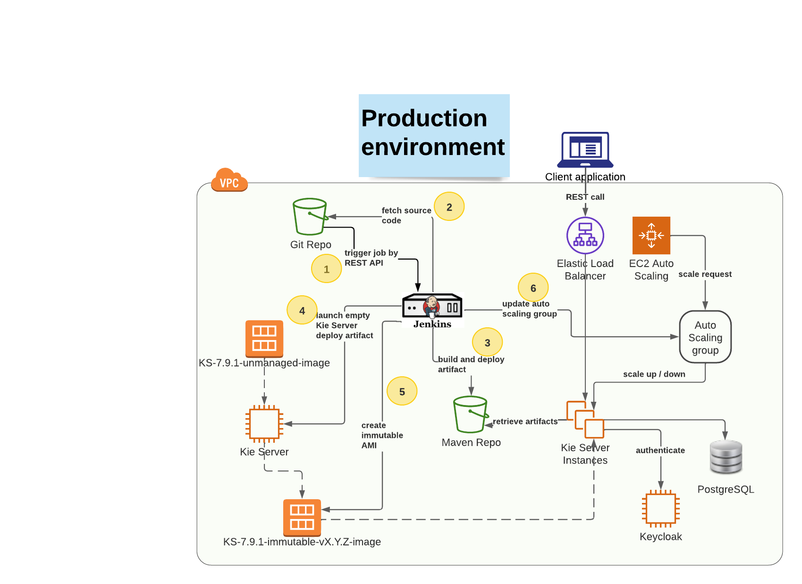

# Demo of production environment pipeline
Showing a real use case development flow and how this triggers the production pipeline to deploy the project artifacts
on a new set of immutable RHPAM Kie Server(s).

* Reference git flow
  * _Master branch has production code_
  * _Feature branch to develop features and merge into master_
  * _`CICD` comment  to trigger the Dev CI/CD pipeline_
  * Changes are validated against Validation pipeline (out of scope)
  * Version is updated from SNAPSHOT to RELEASE
  * `RELEASE` comment to trigger the Production CI/CD pipeline


* Production environment
  * Running unmanaged, immutable servers



## Setup git repository
**Reusing git repo configured for development environment demo**

## Create project on Business Central VM
**Reusing demo project in Demo space configured for development environment demo**

## Configure post-commit hook
**Reusing post-commit hook configured for development environment demo**

## Configure pre-push hook
Following changes are needed to trigger the production pipeline when the `RELEASE` comment is pushed: 
```shell
cd /root/efs-mount-point/.niogit/Demo/demo.git
echo 'read local_ref local_sha remote_ref remote_sha
date >> /tmp/pre-push-log.out
SQUASH_INDICATION=$(git show "$local_sha" | grep -i CICD)
# Only if commit message contains CICD(not case sensitive) then invoke jenkins pipeline.
if [[ -n "${SQUASH_INDICATION}" ]]; then
    echo "waiting 2 seconds before invoking jenkins pipeline..." >> /tmp/pre-push-log.out
    bash -c "sleep 2 \
     ; curl -X GET --user USERNAME:PASSWORD https://JENKINS_SERVER_URL/job/build-artifact/buildWithParameters?token=deploy-artifact-temenos >> /tmp/pre-push-log.out" &

    echo "jenkins invoked successfully" >> /tmp/pre-push-log.out
    echo "ending pre-push hook script, on time:" >> /tmp/pre-push-log.out
    date >> /tmp/pre-push-log.out
fi
RELEASE_INDICATION=$(git show "$local_sha" | grep -i RELEASE)
# Only if commit message contains RELEASE(not case sensitive) then invoke jenkins production pipeline.
if [[ -n "${RELEASE_INDICATION}" ]]; then
    echo "waiting 2 seconds before invoking jenkins pipeline..." >> /tmp/pre-push-log.out
    bash -c "sleep 2 \
     ; curl -X GET --user USERNAME:PASSWORD https://JENKINS_SERVER_URL/job/deploy-immutable-artifact/buildWithParameters?token=deploy-immutable-artifact >> /tmp/pre-push-log.out" &

    echo "jenkins invoked successfully" >> /tmp/pre-push-log.out
    echo "ending pre-push hook script, on time:" >> /tmp/pre-push-log.out
    date >> /tmp/pre-push-log.out
fi
exit 0' > hooks/pre-push
chmod 744 hooks/pre-push
```
This is needed to trigger the pipeline when a commit comment includes the `RELEASE` word

## Application development
**Reusing demo project in Demo space configured for development environment demo**
* Update project version to a new version (SNAPHOT)
* Run `Build&Install` and check the remote Maven repository
* Update project version to release the current version
* Commit with `RELEASE` comment
* Verify using the load-balancer URL that the deployment is updated
  * Get containers
  * Get process
  * Create new process and check the hello message
