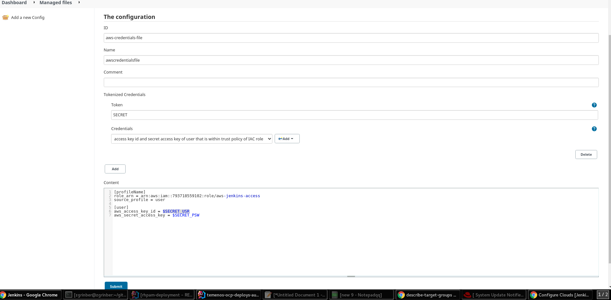

# Provisioning a Jenkins Server on Openshift For CI/CD pipeline on AWS 

## Main Goal - Build CI/CD Pipeline for dev/prod Environments for building artifacts and deploy them on RHPAM'S KieServers Running on AWS for Temenos 
   
### Objective - To create a jenkins Automation server to run on Openshift cluster in order to interact with AWS API and Kie Servers for  deploying artifacts to Kie Servers using pipeline code.
* The Idea is to use bitnami jenkins chart with modified customized image that will
  contain all of the content of the parent image, and in addition will include AWS cli utility to interact
 with AWS console API using its CLI.
* Create the modified desired image and Push it to your repository in containers registry. 

* After having the custom image,  override image name and version of chart to your custom name and version, in addition to a few more values
  in chart.      

* This chart installation supplies admin username and password determined and controlled by the values injected to
  chart when installing jenkins using Helm

 

  
## Prerequisites 

* Helm Package manager version 3 or higher
 , it can be download via the following link:
[Helm installation link][Helm Installation Page]

* Podman CLI - A Lightweight tool for running and manipulating linux containers - can be 
 downloaded from the following link:
[Podman Installation link][Podman Installation Page]
* An account at a containers registry service like quay.io or docker.io

* A Running Openshift Cluster

## Procedure:

### Creating a customized image with jenkins and aws cli utility:

**Create a new image from jenkins bitnami newest image version**

1. Create a Containerfile/Dockerfile with the following content:

```dockerfile
FROM docker.io/bitnami/jenkins:latest

USER root

RUN apt-get update && apt-get install -y less groff awscli

USER jenkins

ENTRYPOINT ["/opt/bitnami/scripts/jenkins/entrypoint.sh"]

CMD ["/opt/bitnami/scripts/jenkins/run.sh"]
```

2. inside the directory of the DockerFile/Containerfile, run(could be any public external registry you have an account in, in this example it's docker.io):
```shell
podman build . -t docker.io/youruser/yourrepo:tag#
```

3. login to the registry using your credentials:
 ```shell
 podman login -u username -p password docker.io
 ```

4. Push the image to your registry:
```shell
podman push docker.io/youruser/yourrepo:tag#
```

### Running Jenkins Instance on Openshift
1. Login to your oc cluster with your credentials.

2.Create a new project (for example your-project=jenkins-test)
```shell
oc new-project your-project
```
#### Jenkins Installation   
3.now We'll use the self created container image from previous step in order to run on cluster Jenkins with AWS cli utility(if wanted to use another registry than docker.io, need to override in values.yaml property volumePermissions.image.registry),notice that JenkinsUser & JenkinsPassword are the credentials of admin user of jenkins:
```shell
helm install jenkins-test  --set jenkinsUser=admin   --set jenkinsPassword=******* \
--set image.repository=youruser/yourrepo --set image.tag=tag# \
--set service.type=ClusterIP --set persistence.size=4Gi \   
--set podSecurityContext.enabled=false \ 
--set containerSecurityContext.enabled=false  bitnami/jenkins 
```
**Note: If the registry is not docker.io, you can override docker.io by supplying other registry like quay.io in parameter volumePermissions.image.registry(e.g ,add to the above command --set volumePermissions.image.registry=quay.io)**

4. Wait for jenkins server to be up and ready

```shell
[zgrinber@zgrinber tmp]$ oc get pods
NAME                            READY   STATUS    RESTARTS   AGE
jenkins-test-587fbcf497-76knq   1/1     Running   0          120s
```

5.expose the service with a Route so it will be able to be accessed from outside the cluster:
```shell
[zgrinber@zgrinber tmp]$ oc expose svc jenkins-test
```
6.Get the route Url and enter it in a web browser, use the user admin credentials determined back in section 3. 
```shell
zgrinber@zgrinber tmp]$ oc get route | awk '!/^(NAME)/' | awk '{print $2}'
jenkins-test-zgrinber-dev.apps.sandbox.x8i5.p1.openshiftapps.com
```
## Jenkins Configuration

### Global Configuration
FIrst, Go to global configuration Inside Jenkins Main screen(Dashboard)-> Go to *Manage Jenkins* on the left panel-> Click on *Configure System*
- **_Define a HOME environment variable for jenkins:_**


   search for `Global properties` header and check a checkbox named "Environment variables"
   , Click the 'add' Button and then fill in the following values in the new fields:
```properties
Name=HOME 
Value= /bitnami/jenkins/home
```
- **_Define a shared library for usage in pipelines_**: 
  
    Search for `Global Pipeline Libraries` Header and click on the 'Add' button.
    a group of fields revealed , populate the fields with following values

#### Text Values:
```prototext 
Name=shared-jenkins-library,
Default Version= main,
Retrieval method= Modern SCM,
Source Code Management=https://github.com/RHEcosystemAppEng/rhpam-deployment.git 


```

#### CheckBox Values:
- [ ] Load implicitly
- [X] Allow default version to be overridden
- [X] Include @Library changes in job recent changes


### Install Plugins:

#### The following plugins are required in order to run the pipelines(some of them already installed):
   
   - Config File Provider Plugin
   - Credentials Binding Plugin
   - Credentials Plugin
   - git plugin
   - Kubernetes(Optional - If wanted to use to run slaves using pod templates)
   - Maven Integration(Optional)
   - Pipeline: Groovy
   - Pipeline: Shared Groovy Libraries
   - Pipeline: SCM Step
   - SCM API Plugin
   - Workspace Cleanup
   - Pipeline Utility Steps
   - Blue Ocean
   - Configuration As Code Plugin(Optional)

#### How to Install Plugins:
in main menu of Jenkins server, go to Manage Jenkins->Click on Manage Plugins->
Then Go to 'Available' tab->in the above search editor field enter the required plugin or look for it
In the presented table of available plugins, next to the desired plugins(can check multiple plugins), check their checkbox
and click below on either of buttons 'Install without Restart' and then click on checkbox 'restart jenkins', as shown in the following pictures


### Credentials and Secrets management:
Jenkins manage and store the credentials in a secured manner and in a secured place, 
and using the 'Credentials Binding Plugin' it can inject any credentials into a pipeline in order to be used,
jenkins and the plugin masking the secrets from being displayed on logs, so they remain secured 
and there is no fear that secrets will be leaked or compromised 
#### The following credentials should be defined in Jenkins(their **_ids_** are listed):
- maven-repo-secret - username and password for maven repository in a remote server
- AWS_CREDENTIALS - AWS Access Key Id and Secret for AWS cli login, should be defined as user and password kind. 
- KS_CREDENTIALS - Kie Server Controller Username and password for interacting with Kie Server using REST API in unmanaged mode.
- BC_CREDENTIALS - Business central controller's Username and password for deploying containers to managed kie servers
- jenkins-sa-token(optional) - In case of using kubernetes pod templates as jenkins agent/slave, this is the token 
  of the service account that jenkins is using to connect to k8s cluster, should be defined with kind of Secret text.


#### How to define credentials in jenkins
From jenkins server main screen, go to Manage Jenkins-> go to security section-> click on Manage Credentials
-> then on the bottom click on '(global)' link under Domains column->on the left panel click on 'Add Credentials'
Then you should fill the details of secret as shown below:

**_username and password kind of secret:_**


**_secret text kind:_**


### Defining external configuration file(Example with maven - settings.xml)
Jenkins, Using 'Config File Provider Plugin', offers a way to decouple config files
From the jenkins agent that the pipeline will run onto, so the configuration file is defined as an object with id, and it can be used through pipeline execution using the plugin,
regardless of the agent that is being used, jenkins inject/mount the rendered file
config file into agent's workspace(file system) only when needed, and there it can be used as file transparently.

From jenkins server main screen, go to Manage Jenkins->at System Configuration-> click on Managed files-> on left panel click on 'Add a new Config' 
, choose Global Maven settings.xml, and then click on the Add button to add ServerId and credentials for authentication to it, for example


_**where the given settings.xml for this is as follows:**_
```xml
<settings xmlns="http://maven.apache.org/SETTINGS/1.0.0" xmlns:xsi="http://www.w3.org/2001/XMLSchema-instance"
          xsi:schemaLocation="http://maven.apache.org/SETTINGS/1.0.0 https://maven.apache.org/xsd/settings-1.0.0.xsd">
    <profiles>
        <profile>
            <id>rhpam</id>
            <activation>
                <activeByDefault>true</activeByDefault>
            </activation>
            <repositories>
                <repository>
                    <id>redhat-ga</id>
                    <url>https://maven.repository.redhat.com/ga/</url>
                </repository>
            </repositories>
            <pluginRepositories>
                <pluginRepository>
                    <id>redhat-ga</id>
                    <url>https://maven.repository.redhat.com/ga/</url>
                </pluginRepository>
            </pluginRepositories>
            <distributionManagement>
                <repository>
                    <id>rhpam</id>
                    <url>https://repo.repsy.io/mvn/dmartino/rhpam</url>
                </repository>
            </distributionManagement>
        </profile>
    </profiles>
</settings>
```
**_Note: Need to specify in ServerId the desired id of server (to deploy artifacts)
in settings.xml and choose jenkins credentials for the maven repo 
and then the plugin will inject the user/password to the rendered
settings.xml that will be injected to running agent during runtime_**

### Configure Authentication to AWS from Jenkins using AWS IAC Role:

Authentication through main Access key ID and Secret of an account( which have admin privileges)  can be replaced with 
another Mechanism in which the authentication is made with an unprivileged user(from operation and actions that can be made on AWS cli perspective) ,
which has a dedicated permission to 'assume a role' for a particular role that will grant this user its authorization and permissions to
for all operation and actions that are specified and defined in the role.

#### Preliminary Settings in AWS Console

1. Go to AWS console, login to your account, and enter to IAM module there - https://console.aws.amazon.com/iamv2/home#/home
2. Create new role -> go to left panel Access management group -> click on Roles -> Click on button 'Create role' --> choose usecase EC2,
 and click on button\
 located at the bottom 'Next: Permissions'
  And in the new screen , choose and attach the following policies at least for DEV Pipeline(AWS predefined policies)
   1. AutoScalingFullAccess
   2. AmazonEC2ReadOnlyAccess, 
      If needed a more constrainted policy instead of the first policy, can create a new policy for the actual
      operations that are performed during the pipeline, as below:
```json
{
  "Version": "2022-01-27",
  "Statement": [
    {
      "Effect": "Allow",
      "Action": [
        "autoscaling:UpdateAutoScalingGroup",
        "autoscaling:CreateLaunchConfiguration"
      ],
      "Resource": "*"
    }

  ]
}
   
```
3. define some user with minimum permissions(unprivileged user) , and create for it
   access key - programmatic access(access key id and secret). can copy permissions from existing unprivileged user. 
    
4. Grant the user from section 3 the assumerole permission for role created in section 2:
   1. Go to Roles on the left panel-> look up in the text editor search field for your role and enter it 
   2. Go to Trust relationships tab-> click on button 'Edit trust relationship'
   3. inside the Policy Document, define a permission for the user, as shown in the following json, 
   need to insert a new entry to the JSON Array with the ARN of user from section 3 as value for  key Principal.AWS, when finished, click on 'Update Trust Policy'
```json
{
  "Version": "2012-10-17",
  "Statement": [
    {
      "Effect": "Allow",
      "Principal": {
        "Service": "ec2.amazonaws.com"
      },
      "Action": "sts:AssumeRole"
    },
    {
      "Effect": "Allow",
      "Principal": {
        "AWS": "arn:aws:iam::793718559102:user/zgrinber"
      },
      "Action": "sts:AssumeRole"
    }
  ]
}
```

#### Configuration and settings in Jenkins

1. Define Credential entry at jenkins for access key id(as username) and access key secret(as password) for the unprivileged user that was created in AWS
   As described in [How to define credentials in jenkins](#how-to-define-credentials-in-jenkins)
2. Need to define an environment variable named 'AWS_PROFILE' with some profile name.
   it should be done in agent configuration or if running the pipeline on jenkins master, go to Manage Jenkins->Configure System
   ->search for global properties->check environment variables checkbox or if check, add new environment variable
```properties
Name=AWS_PROFILE
Value=profileName
```
3. create new configuration file object in jenkins ('Config File Provider' Plugin installed is a prerequisite) 
      1. From Jenkins main screen, go to Manage Jenkins on left panel-> click on 'Managed file'->
      on the left panel click on 'Add a new Config'--> choose 'Custom file' radiobutton --> on the bottom, go to 'ID'
      field, and type some meaningful name , for example: aws-credentials-file-> press on submit.
      2. on appeared screen ,fill in all details as follows:
         
      An Explanation for all fields:
   ```prototext
   ID=Name of the file object to be used in pipeline whenever referenced,
   
   Name= Can be the same,
   
   Comment= Optional description of file object,
   
   Token= Definition of Place holder to be replaced with new values of user and password when used by pipeline, should be hardcoded SECRET.
   
   Credential=Choose the Credentials that was created in section 1,
   
   Content= the file structure skeleton. need to contain the following values:
   
      1.[profileName] - the name of the profile exactly as defined in section 2.
      2.role_arn - the full arn of the aws role that was created.
      3.source_profile - the user name to authenticate to aws with 
      4.[user] - header of user name(should be the same as the value in section 3).
      5.aws_access_key_id - should be $SECRET_USR so jenkins and plugin will know to
                            inject the username of credential here when used by pipeline code.
      6.aws_secret_access_key -should be $SECRET_PSW so jenkins and plugin will know to
                            inject the password of credential here when used by pipeline code.    

   ```
   When finishing filling everything, click on submit.    

4. Usage in pipeline - need to specify the file object id that was defined in former step
   as can be  [seen here](./JenkinsfileDeployArtifact#L26-L39)

   
   
   


### Setup A Kubernetes pod template agent

Jenkins jobs can run on master node(jenkins master), but it's not considered
as best practice because of the following reasons:

- running pipelines on master can rise security issues as the build information
  and data, as well as some of the configuration can be accessed during the run in case the jenkins master 
  is breached , and if the pipeline code doesn't take care explicitly of cleaning the workspace at the
  end of the run, then the data of the build persisted on master's file system itself until
  initiative clean-up/house-keeping procedure take place, which is very bad.


- from performance point of view, running all pipelines jobs on master node can lead
  to poor performance, as jenkins in this case has to run itself all pipelines, allocate a thread
  to each running build, and in addition to that, it already has managing tasks of its own , and it needs to listening to new incoming jobs, and etc. 

**_Note: there is no obligation to use kubernetes pod templates for jenkins agents,
   it's just one option among others, below several of them:_**
- running jenkins agents from docker images, and connecting to container using SSH.
- running jenkins agents on aws EC2 instances using a designated plugin.
- running jenkins agents on bare metal machines that is accessible to jenkins master 
  via some network
- running jenkins agents from pod template in k8s/openshift clusters.
- and several more...

**_We'll go through the setup and configuration required to setup pod templates
agents in jenkins that will run in an openshift cluster._**

**_Note: Kubernetes Plugin for jenkins is a Prerequisite for running pod template agents on jenkins_**
#### First Step: Create Service Account in openshift Cluster

1. login to openshift cluster using oc login.
2. switch to project/namespace that you want projects to run in, for example,
   if wants to run in the same project where jenkins master is running, type:
```shell
oc project jenkins-test
```
3. Create a service account for jenkins so that it will be able to access the cluster:
```shell
oc create serviceaccount jenkins -n jenkins-test
```
4.Create a Role object to define the authorized access actions and objects
```shell
cat > jenkins-role.yaml << EOF
---
kind: Role
apiVersion: rbac.authorization.k8s.io/v1beta1
metadata:
  name: jenkins
rules:
- apiGroups: [""]
  resources: ["pods"]
  verbs: ["create","delete","get","list","patch","update","watch"]
- apiGroups: [""]
  resources: ["pods/exec"]
  verbs: ["create","delete","get","list","patch","update","watch"]
- apiGroups: [""]
  resources: ["pods/log"]
  verbs: ["get","list","watch"]
- apiGroups: [""]
  resources: ["secrets"]
  verbs: ["get"]
EOF

```
```shell
oc apply -f jenkins-role.yaml -n jenkins-test
```
5.Create a Role-binding to bind the created Role to our ServiceAccount:
```shell
cat > jenkins-rolebinding.yaml << EOF
---
apiVersion: rbac.authorization.k8s.io/v1
kind: RoleBinding
metadata:
  name: jenkins
  namespace: jenkins-test
roleRef:
  apiGroup: rbac.authorization.k8s.io
  kind: Role
  name: jenkins
subjects:
- kind: ServiceAccount
  name: jenkins
EOF
```
```shell
oc apply -f jenkins-rolebinding.yaml -n jenkins-test
```
6. get the secret token of the service account in clusterto be later defined 
   in jenkins as credential:
```shell
oc get secret $(oc get sa jenkins -n jenkins-test -o jsonpath={.secrets[0].name}) -n jenkins-test -o jsonpath={.data.token} | base64 --decode
```

7.get the certificate authority ca.crt file secret of serviceAccount in openshift cluster
  to be later defined as 'Kubernetes server certificate key' field in configure cloud when defining openshift cloud at jenkins:  
```shell
oc get secret $(oc get sa jenkins -n jenkins-test -o jsonpath={.secrets[0].name}) -n jenkins-test -o jsonpath={.data.'ca\.crt'} | base64 --decode
```


8.If running on the same namespace as jenkins master, you can apply this service account to jenkins deployment:
```shell
oc patch deployment/jenkins-test -p '{"spec":{"template":{"spec":{"serviceAccount":"jenkins"}}}}'
```
9. Optional - Define A PVC for high performance build with maven, so the third party libraries and
   Dependencies will not be re-downloaded for every artifact build, but only the delta needed, and every build run duration will
   be shortened by 2-5 minutes, depending on download speed of internet connection. 
   
```shell
cat > jenkins-rolebinding.yaml << EOF
---
apiVersion: v1
kind: PersistentVolumeClaim
metadata:
  annotations:
    volume.alpha.kubernetes.io/storage-class: default
  labels:
    app.kubernetes.io/instance: jenkins-test
    app.kubernetes.io/name: jenkins
  name: jenkins-test-slave
  namespace: jenkins-test
spec:
  accessModes:
  - ReadWriteOnce
  resources:
    requests:
      storage: 3Gi
  volumeMode: Filesystem
status:
  accessModes:
  - ReadWriteOnce
  capacity:
    storage: 3Gi

EOF
```
The pvc Name created should be inputted in the cloud definition of openshift in Jenkins.\
See the last properties name 'PersistentVolumeClaim' in next step at section 4's explanation [here](#explanation-for-fields-openshift-cloud)


#### Second Step: Define Openshift Cloud in jenkins
1. in main menu of Jenkins server, go to Manage Jenkins->In System configuration Section
   go to 'Manage Nodes And Clouds'->Go on the left panel to Configure Clouds->
   press on button/drop down list 'Add a new cloud', and choose Kubernetes.
2. In Name field call it Openshift, and click on Kubernetes Cloud Details.
3. A new screen appeared with several fields, beside name that already entered
   fill in the following details:
```prototext
Kubernetes URL = the url of openshift API server, 
for example - https://api.ocp-dev01.lab.eng.tlv2.redhat.com:6443

Kubernetes server certificate key - paste here the value from former step section 7

Kubernetes Namespace= namespace/project where pod agents will run - 
for example in our case - jenkins-test
    
Credentials= click on add button-> you will navigated to add new secret, choose kind
of secret text,in secret field paste in the value from section 6 from former step.
give id and description and after adding it, choose it as the credentials.

Checkbox 'WebSocket' must be checked to enable agents to connect using
HTTP protocol over TCP/IP rather than raw TCP transport.

jenkins URL = the url of jenkins master for agents to log into it- if jenkins
running in the cluster then need to give the service dns name of jenkins in
 openshift cluster or cluster ip of svc or ip of pod 
that running Jenkins, with port 8080.
for example : http://jenkins-test.jenkins-test.svc.cluster.local:80,
given that the service port is 80, and the targetPort of container is 8080. 
    
Pod label:
key=jenkins,
Value=agent
The remaining fields can stay with default values.
```
4. After filling all above fields, click on button "Pod Template Details..."
   and then click on Add Pod Template, and you should supply image for the pod
   that will run when the pod agent will be created by jenkins, and additional details like label,Volume , etc.\
   see example in the screenshots below:


#### Explanation for fields openshift cloud
```properties
Name = the Pod template name,
Namespace = in which namespace in the cluster the agent pod will run
Labels = the name of the agent pod in order to instruct jenkins to run a pipeline code on it 
ContainerName = the name of the container of the agent in pod
DockerImage = the Docker image that the container will be derived from - must be a sub image of jenkins/agent or jenkins/slave, preferred jenkins/jnlp-slave:latest so it will contain the agent entrypoint script in addition to agent and slave jars, and in this particular case must contain maven installed , i used image docker.io/jenkins/jnlp-agent-maven:jdk11
WorkingDirectory = the directory in which the agent will work in when provisioned for a pipeline
PersistentVolumeClaim = Under Volumes Section, a name of PVC that can be mounted into mount path in container in order to increase performance of build, for example, for a maven builder agent, it's sensible to mount a pvc to the agent's local repository directory, so it will not need to download the artifacts over and over on each build, just refresh whatever is new or deleted.              
```
5.Click on Save.

6.Go to Manage Jenkins->Security section->click on Configure Global Security->
   in Agents Section, choose radioButton Random,
   And in 'Agent - Controller Security', check checkbox 'Enable Agent -> Controller Access Control'

#### Create AWS Jenkins Agent Image

It's apparent that Jenkins master contains an old version of AWS cli.\
The reason for it is that when the jenkins image was created, the APT high level tool
for Debian package manager(Debian is the linux distribution being used in jenkins master server official image ),
installed a very old version of AWS cli, and this is a common issue with APT.
As a result, with the need to install a new version of AWS cli tool, we'll take this situation as opportunity 
to create jenkins aws agent(slave), that will contain a new version of aws cli , and on
that way will benefit from running the deployment job on a dedicated agent instead of on jenkins master.

Using the ServiceAccount created in First Step, and the Openshift Cloud defined
in the Second Step, we only have to create a custom slave image with what we need,
and define a new pod template in the Openshift Cloud at jenkins.

**_Steps to be performed:_**
1. Create A Dockerfile for creating the jenkins aws slave image
```dockerfile
FROM jenkins/jnlp-slave:latest

USER root

RUN apt-get update && apt-get install -y tree less groff unzip  
RUN curl "https://awscli.amazonaws.com/awscli-exe-linux-x86_64.zip" -o "awscliv2.zip" \
    && unzip awscliv2.zip ; ./aws/install \
    
USER jenkins    
```

2. Build the new image using podman or buildah tools:
```shell
zgrinber@zgrinber /]$ buildah bud -f DockerFile

or

[zgrinber@zgrinber /]$ podman build .
```


3. tag the new created image with buildah or podman with repo name and path that will reflect
   the registry server, your account and repo name in the remote registry, for example:
  
```shell
[zgrinber@zgrinber /]$ buildah tag #createdImageNumber quay.io/zvigrinberg/jenkins-agent:aws2
or 
[zgrinber@zgrinber /]$ podman tag #createdImageNumber quay.io/zvigrinberg/jenkins-agent:aws2
````
4. Login to your registry account using your credentials:
```shell
[zgrinber@zgrinber /]$ podman login quay.io --user bbbbbbb --password aaaaaaa
```
5. push the image to the registry:
```shell
[zgrinber@zgrinber /]$ podman push quay.io/zvigrinberg/jenkins-agent:aws2
```


6. Create a secret in openshift for the credentials that will be used to pull the image from registry:
```shell
[zgrinber@zgrinber /]$ oc create secret docker-registry --docker-server=quay.io \ 
   --docker-username=your_username --docker-password=yourpassword \
   --docker-email=unused registry-name
```

7. Link the new pull secret to the 'jenkins' service account used by jenkins to connect to openshift cluster:

```shell
[zgrinber@zgrinber /]$ oc secret link jenkins registry-name --for=pull
```

8. In Jenkins, Define a new pod Template that will use the image that was
   just created.\
   In main menu of Jenkins server, go to Manage Jenkins->In System configuration Section
   go to 'Manage Nodes And Clouds'->Go on the left panel to Configure Clouds-> in Kubernetes Cloud
   with Name=Openshift, Click on the 'Pod Templates...' button, and press on button 
   called 'Add Pod Template'\
   The following values should be supplied:
   
   
  

   **_Important Note: If we're running aws on slave, we have to neutralize/delete
   the global environment variable called 'HOME' in jenkins settings, otherwise the global definition
   will override the environment variable in container and will cause errors when using aws cli tool_**

   See [the definition here](#global-configuration) - You need just to delete the environment variable in 
   case you're using this agent and not planning to run aws on jenkins master.
### Jenkins - Configuration As Code Plugin

 This plugin can export most of the configuration in jenkins(
beside jobs configuration and plugins configuration) to a YAML file,
So most of the configuration can be expressed in a declarative way in
 that file, For example:
 ```yaml
 credentials:
   system:
     domainCredentials:
       - credentials:
           - string:
               description: "Jenkins ServiceAccount Token"
               id: "jenkins-sa-token"
               scope: GLOBAL
               secret: "{AQAAABAAAATwmw4RprFIw9r05+DzIZOANvCw9RCQehy7/9mrRRhGYueGGfcjbcRV27VDnfQHDoa//CiKI0PtCk3TcoeDR57G9H7NUdt9JQ10i9m/LmbKuevXhrC3tfAXSNWJMUwHOs4ju/PwZ2/l3ViaVldUwxZZ/ZlaOODl5BYU+T5LZQdFXNPawcONoTLeMZMSxq4aNVGYiEUOTYedIpL5cLJZ06Mx1dRMbK8PyZu5HuN2a72btyZf75wJddRZ8PAIqBAiS3uLuvi2UFsSEBLHlbL8V+c2tlqklLAAqG1vywBOlvUORH0Jq9iyJW9HQwy9wl3NPcithR1pTaPPY/uVuq29uPsJh8mhjMVm63lf2ES8MfGQuglqJzSbcVqN4ybPA04jPbUyPmAYJgV/H67SSAnPEgdPM7tvfG7APG1HYvV7oWnt9yKKUctTnTCb2d+Vt/IWQE8hlmXCK4rCiczqMAq/ApnIoESj61nBDZXEqX0Y88U+TPJ3r9tAF5Q4NfwLdOp2ddKgQzOTce7rD+tpd38dYlNZRUU6f6OOb3qXgumDSxeBrC+BWVEAQp9uv77teFJ7AHlzqABdi3Pz46iIePsYDwXWOf/eskDu4M4Ehv7yl3EgELynyMsocI9rzuOfVM8Dp/xMWC4Vr7M/r/QdTjUlxps+hm0L/2m4HwB/y3M/Cwhtbj9JbArETPmGQs0/wpdXJ+memlBbj2gr9OS38eGyYPCahBRIIxMuMn8ML60Gy4vni1Bxrvo1lc25wNGCOeVNufiZL66Xc8dXhXyCP9yZDAkhZSF4h9PIUEgFO9eVnTP0y3Pr4L6Kpi0sLNaEcYC6VL7ayQN40f0mk2w9a/dpkuHMdBQsnbMUzN/j4hyXlhBVxJve5lwB49gBCyP4weJ0YRNr1uT7pSBH5m1flYrbpKZwuZMz9PhxPEK0GzGurbta+sR/gi+wBL4u0fetKUIVhsiKWH/4VL/qb0SUyalwtbik+a7q666xGnpNlzRB8wqEsZ6Rnwl5JxZKmAV0I4Sk/gduaPz0Ek/ovn85iJtk68Ih2a5ihscY/VI3ulC/4LgoAG/tM5VQdyr6iVjPQW1O0PskL9plOdIE3hY3RoZwl9OjEUvq9fd5q6q+CeFVA5v75HiOAURd1lq/H/2BJQA682PxqQ7M2Ma8UUIZQ8QDmaQGQ0vn0MHhKRuML5Lvurkx80gSgwYIq0aVgPB135EFzjB5flLbCXr5MSPkdR6p8O8tbu6mu5FmWQmXdvTOhwZrFUmlCT9JgPgyR1WKOjr39/msHeByIADVeXA9fWfoDe4sm46XT1o/9UcSjejDrMFCqC6uLiogWMUqG9aE2ZoRhukiKEWmVaM1zQ6UxjR0CVxYdszKBdoAuk4C2MP4tVGYEt3r+myb4D3KwTYf5PWkaXzwldCfpcPYl1R+wG+PCAdSmCZqJDKT9vUUi6PxTVO5SBBW4DtuvLD/P2uLCpCRiE7S0UK/+n3QB6qjT335kBfoNZo3GM4klGSbE1rrclm1sZ3SgUcXqp/PnQannM6tPFT0Glurv8gEny7zQh2+YYqjIvtVZCLimaJD6nCf9jwZ0re8JAYorTSW2oHA3zSnOZ6rQkzRLf4/4O/MNHu9s5pYuoRP9qUvMvrFo80imcM91CYuWtM+MNFdbk2SQ69jg6eqnWqsWNXuAli4JnixfFopcJ14G2vJSwiBIJ+mrOzsSPU=}"
           - usernamePassword:
               description: "username and password for maven repository"
               id: "maven-repo-secret"
               password: "{AQAAABAAAAAQZrzexuLtdRy5hOk+pGGfjiXfyr1di0XhVxapNiWVmsc=}"
               scope: GLOBAL
               username: "aaaaaaaaa"
               usernameSecret: true
           - usernamePassword:
               description: "AWS Access Key Id and Secret"
               id: "AWS_CREDENTIALS"
               password: "{AQAAABAAAAAwX3JeSYhC11kW9i9IIX9RgHipP1K1cQ7NZT/sI8xXUDGs57g5w5VWcPuN2VsQH+nw+F0Ue1o0NZ9zq0zpGg6J+A==}"
               scope: GLOBAL
               username: "bbbbbbbb"
               usernameSecret: true
           - usernamePassword:
               description: "Kie Server Controller User and password"
               id: "KS_CREDENTIALS"
               password: "{AQAAABAAAAAQn2Mr7z7pCl+0R1U/SUv4/zRA1ftPq1lDAkvvtZfm1ew=}"
               scope: GLOBAL
               username: "controller"
               usernameSecret: true
 jenkins:
   agentProtocols:
     - "JNLP4-connect"
     - "Ping"
   authorizationStrategy:
     loggedInUsersCanDoAnything:
       allowAnonymousRead: false
   clouds:
     - kubernetes:
         containerCap: 10
         containerCapStr: "10"
         credentialsId: "jenkins-sa-token"
         jenkinsUrl: "http://10.131.0.98:8080"
         name: "Openshift"
         namespace: "jenkins-test"
         serverCertificate: |
           -----BEGIN CERTIFICATE-----
           Certificate-keys-goes-here-1
           -----END CERTIFICATE-----
           -----BEGIN CERTIFICATE-----
           Certificate-keys-goes-here-2
           -----END CERTIFICATE-----
           -----BEGIN CERTIFICATE-----
           Certificate-keys-goes-here-3
           -----END CERTIFICATE-----
           -----BEGIN CERTIFICATE-----
           Certificate-keys-goes-here-4
           -----END CERTIFICATE-----
         serverUrl: "https://api.ocp-dev01.lab.eng.tlv2.redhat.com:6443"
         templates:
           - containers:
               - image: "docker.io/jenkins/inbound-agent:latest"
                 livenessProbe:
                   failureThreshold: 0
                   initialDelaySeconds: 0
                   periodSeconds: 0
                   successThreshold: 0
                   timeoutSeconds: 0
                 name: "jnlp"
                 workingDir: "/home/jenkins/agent"
             id: "c1c4d9e7-a3f5-495a-8ce1-c4bb384deae9"
             label: "kubeagent"
             name: "kube-agent"
             namespace: "jenkins-test"
             yamlMergeStrategy: "override"
           - containers:
               - envVars:
                   - envVar:
                       key: "HOME"
                       value: "/home"
                 image: "docker.io/jenkins/jnlp-agent-maven:jdk11"
                 livenessProbe:
                   failureThreshold: 0
                   initialDelaySeconds: 0
                   periodSeconds: 0
                   successThreshold: 0
                   timeoutSeconds: 0
                 name: "jnlp"
                 workingDir: "/home"
             id: "0d0c6195-9f26-4f2e-9fb6-a1fff7f1a540"
             label: "mvnjdk11"
             name: "jdk-maven-slave"
             namespace: "jenkins-test"
             volumes:
               - persistentVolumeClaim:
                   claimName: "jenkins-test-slave"
                   mountPath: "/home/.m2"
                   readOnly: false
             yamlMergeStrategy: "override"
   crumbIssuer:
     standard:
       excludeClientIPFromCrumb: true
   disableRememberMe: false
   globalNodeProperties:
     - envVars:
         env:
           - key: "HOME"
             value: "/bitnami/jenkins/home"
   labelAtoms:
     - name: "built-in"
     - name: "kubeagent"
     - name: "mvnjdk11"
   markupFormatter: "plainText"
   mode: NORMAL
   myViewsTabBar: "standard"
   numExecutors: 2
   primaryView:
     all:
       name: "all"
   projectNamingStrategy: "standard"
   quietPeriod: 5
   remotingSecurity:
     enabled: true
   scmCheckoutRetryCount: 0
   securityRealm:
     local:
       allowsSignup: false
       enableCaptcha: false
       users:
         - id: "admin"
           name: "admin"
           properties:
             - "apiToken"
             - "mailer"
             - "myView"
             - preferredProvider:
                 providerId: "default"
             - "timezone"
             - favoriting:
                 autofavoriteEnabled: true
             - "favorite"
   slaveAgentPort: 0
   updateCenter:
     sites:
       - id: "default"
         url: "https://updates.jenkins.io/update-center.json"
   views:
     - all:
         name: "all"
   viewsTabBar: "standard"
 globalCredentialsConfiguration:
   configuration:
     providerFilter: "none"
     typeFilter: "none"
 security:
   apiToken:
     creationOfLegacyTokenEnabled: false
     tokenGenerationOnCreationEnabled: false
     usageStatisticsEnabled: true
   sSHD:
     port: -1
   scriptApproval:
     approvedSignatures:
       - "method groovy.lang.GroovyObject invokeMethod java.lang.String java.lang.Object"
       - "staticMethod org.codehaus.groovy.runtime.DefaultGroovyMethods getAt java.util.Collection\
      \ java.lang.String"
 unclassified:
   bitbucketEndpointConfiguration:
     endpoints:
       - bitbucketCloudEndpoint:
           enableCache: false
           manageHooks: false
           repositoriesCacheDuration: 0
           teamCacheDuration: 0
   buildDiscarders:
     configuredBuildDiscarders:
       - "jobBuildDiscarder"
   buildStepOperation:
     enabled: false
   email-ext:
     adminRequiredForTemplateTesting: false
     allowUnregisteredEnabled: false
     charset: "UTF-8"
     debugMode: false
     defaultBody: |-
       $PROJECT_NAME - Build # $BUILD_NUMBER - $BUILD_STATUS:

       Check console output at $BUILD_URL to view the results.
     defaultContentType: "text/plain"
     defaultSubject: "$PROJECT_NAME - Build # $BUILD_NUMBER - $BUILD_STATUS!"
     defaultTriggerIds:
       - "hudson.plugins.emailext.plugins.trigger.FailureTrigger"
     maxAttachmentSize: -1
     maxAttachmentSizeMb: -1
     precedenceBulk: false
     watchingEnabled: false
   fingerprints:
     fingerprintCleanupDisabled: false
     storage: "file"
   gitHubConfiguration:
     apiRateLimitChecker: ThrottleForNormalize
   gitHubPluginConfig:
     hookUrl: "http://jenkins-test-jenkins-test.apps.ocp-dev01.lab.eng.tlv2.redhat.com/github-webhook/"
   gitSCM:
     addGitTagAction: false
     allowSecondFetch: false
     createAccountBasedOnEmail: false
     disableGitToolChooser: false
     hideCredentials: false
     showEntireCommitSummaryInChanges: false
     useExistingAccountWithSameEmail: false
   globalConfigFiles:
     configs:
       - mavenSettings:
           comment: "User settings"
           content: |-
             <settings xmlns="http://maven.apache.org/SETTINGS/1.0.0" xmlns:xsi="http://www.w3.org/2001/XMLSchema-instance"
               xsi:schemaLocation="http://maven.apache.org/SETTINGS/1.0.0 https://maven.apache.org/xsd/settings-1.0.0.xsd">
                 <profiles>
                     <profile>
                         <id>rhpam</id>
                         <activation>
                             <activeByDefault>true</activeByDefault>
                         </activation>
                         <repositories>
                             <repository>
                                 <id>redhat-ga</id>
                                 <url>https://maven.repository.redhat.com/ga/</url>
                             </repository>
                         </repositories>
                         <pluginRepositories>
                             <pluginRepository>
                                 <id>redhat-ga</id>
                                 <url>https://maven.repository.redhat.com/ga/</url>
                             </pluginRepository>
                         </pluginRepositories>
                         <distributionManagement>
                             <repository>
                                 <id>rhpam</id>
                                 <url>https://repo.repsy.io/mvn/dmartino/rhpam</url>
                             </repository>
                         </distributionManagement>
                     </profile>
                 </profiles>
             </settings>
           id: "maven-settings"
           isReplaceAll: true
           name: "settingsxml"
           providerId: "org.jenkinsci.plugins.configfiles.maven.MavenSettingsConfig"
           serverCredentialMappings:
             - credentialsId: "maven-repo-secret"
               serverId: "rhpam"
   globalLibraries:
     libraries:
       - defaultVersion: "main"
         name: "shared-jenkins-library"
         retriever:
           modernSCM:
             scm:
               git:
                 id: "f1e8168c-1058-410c-be40-c20415dfee91"
                 remote: "https://github.com/RHEcosystemAppEng/rhpam-deployment.git"
                 traits:
                   - "gitBranchDiscovery"
   junitTestResultStorage:
     storage: "file"
   location:
     adminAddress: "zgrinber@redhat.com"
     url: "http://jenkins-test-jenkins-test.apps.ocp-dev01.lab.eng.tlv2.redhat.com/"
   mailer:
     charset: "UTF-8"
     useSsl: false
     useTls: false
   mavenModuleSet:
     localRepository: "default"
   pollSCM:
     pollingThreadCount: 10
   subversionSCM:
     workspaceFormat: 8
   timestamper:
     allPipelines: false
     elapsedTimeFormat: "'<b>'HH:mm:ss.S'</b> '"
     systemTimeFormat: "'<b>'HH:mm:ss'</b> '"
 tool:
   git:
     installations:
       - home: "git"
         name: "Default"
   maven:
     installations:
       - name: "maven"
         properties:
           - installSource:
               installers:
                 - maven:
                     id: "3.8.4"
   mavenGlobalConfig:
     globalSettingsProvider: "standard"
     settingsProvider: "standard"
```
 - The Credentials passwords are encrypted using some encryption's key of the plugin.
 - The Credentials usernames are not encrypted, thus were obscured intentionally manually.
 - Unfortunately, when trying to import the yaml into jenkins, it sometimes failed, so when not
   working in such cases, can be used as a compact way of storing the data of configuration in jenkins in a structured way
 - Opened To do - An Attempt to import the configuration from yaml to jenkins with the 'credentials' 
   portion omitted(import a yaml with only 'jenkins' portion)

### Job Configuration

- The jobs configuration are stored in xml files inside jenkins master
  in the following directory -  $JENKINS_HOME/jobs.
- Each job has its own directory and contains:


  1. builds directory with all build numbers and their data and logs.

  
  2. File that keep the number of Next Build Number.

  
  3. config.xml, the job configuration in jenkins , using it you can 
     export a job configuration from one jenkins server to another.
     you just have copy the directory of the job in $JENKINS_HOME/jobs
     from jenkins A to $JENKINS_HOME/jobs in jenkins B(usually only config,xml
      will be sufficient as we don't want history of builds and logs of Jenkins B). 
  
- the job configuration may contain pipeline code as well, but in 
     this one I'm using a PAAC(Pipeline As a Code) approach, where the
     pipeline code is separated from job configuration, and are only referenced
     and fetched by job configuration, usually from a remote git repository where
     it's defined, it's better to manage it that way because we can manage the versions of
     the pipeline and keep track of pipeline's changes using git in a more convenient, easy and elegant way   

There are two jobs in the pipeline:

1. Build Artifact - Which checkout a git repository contains a RHPAM project ,
   parse the pom.xml of it, takes that groupId, Artifact, And version, and build
   the project using maven, a KJAR artifact is generated and deployed to a remote
   maven server, afterwards it invokes a deployment job(Deploy Artifact job) of that artifact with its
   exact id(groupId,artifact,Version), and an AWS region to deploy the artifact to the
   KIE Servers at this region, optionally can include an invocation command of the deploy job
   for each relevant AWS region.
   

   [The pipeline's code of this job - can be viewed here](./JenkinsfileBuildArtifact)

2. Deploy Artifact - which get as parameters the groupId, artifact and version(abbreviated - 'GAV'),
   authenticate itself to aws using aws cli to the region parameter, and deploy
   the maven artifact to all kie servers registered and managed by BC, and then update the auto-scaling group
   to be with a new launch configuration that will have a new user-data with details of new deployed artifact.
   the pipeline code(JenkinsFile) files for dev & prod are different, as the requirements are different
     
   Assumptions that the pipeline makes:
   1. the Auto Scaling Group(ASG) of the Kie Servers is a parameter to the pipeline code, with some default name.
   
   2. launch Configuration base name of ASG is known to the pipeline code.
   
   3. Kie Servers instances all have tag called 'app' with value of 'RHPAM-KS' and it's derived from ASG when a scale out action 
      is performed- can be changed in pipeline to whatever value that is desired and defined in ASG.
      In other words, the ASG defines a tag with key= 'app' and value = 'RHPAM-KS', and its tag new instance = yes.
        

   
   
[The pipeline's code of this job in dev environment -  can be viewed here](./JenkinsfileDeployArtifact)


 


   
_**Note:The pipeline code for production environment is in progrss**_

#### Job Build Artifact Config:

```xml
<?xml version='1.1' encoding='UTF-8'?>
<flow-definition plugin="workflow-job@1145.v7f2433caa07f">
  <actions/>
  <description></description>
  <keepDependencies>false</keepDependencies>
  <properties>
    <org.jenkinsci.plugins.workflow.job.properties.PipelineTriggersJobProperty>
      <triggers>
        <hudson.triggers.SCMTrigger>
          <spec>* * * * *</spec>
          <ignorePostCommitHooks>false</ignorePostCommitHooks>
        </hudson.triggers.SCMTrigger>
      </triggers>
    </org.jenkinsci.plugins.workflow.job.properties.PipelineTriggersJobProperty>
  </properties>
  <definition class="org.jenkinsci.plugins.workflow.cps.CpsScmFlowDefinition" plugin="workflow-cps@2648.va9433432b33c">
    <scm class="hudson.plugins.git.GitSCM" plugin="git@4.10.1">
      <configVersion>2</configVersion>
      <userRemoteConfigs>
        <hudson.plugins.git.UserRemoteConfig>
          <url>https://github.com/RHEcosystemAppEng/rhpam-deployment/</url>
        </hudson.plugins.git.UserRemoteConfig>
      </userRemoteConfigs>
      <branches>
        <hudson.plugins.git.BranchSpec>
          <name>*/main</name>
        </hudson.plugins.git.BranchSpec>
      </branches>
      <doGenerateSubmoduleConfigurations>false</doGenerateSubmoduleConfigurations>
      <submoduleCfg class="empty-list"/>
      <extensions/>
    </scm>
    <scriptPath>eap/rhpam-on-aws-automation-postgresql/jenkins/JenkinsfileBuildArtifact</scriptPath>
    <lightweight>true</lightweight>
  </definition>
  <triggers/>
  <disabled>false</disabled>
</flow-definition>

```


#### Job Deploy Artifact Config
```xml
<?xml version='1.1' encoding='UTF-8'?>
<flow-definition plugin="workflow-job@1145.v7f2433caa07f">
  <actions/>
  <description></description>
  <keepDependencies>false</keepDependencies>
  <properties>
    <hudson.model.ParametersDefinitionProperty>
      <parameterDefinitions>
        <hudson.model.StringParameterDefinition>
          <name>GROUPID</name>
          <description>Project-id in the pom.xml</description>
          <trim>false</trim>
        </hudson.model.StringParameterDefinition>
        <hudson.model.StringParameterDefinition>
          <name>ARTIFACTID</name>
          <description>The artifact name in pom.xml</description>
          <trim>false</trim>
        </hudson.model.StringParameterDefinition>
        <hudson.model.StringParameterDefinition>
          <name>ARTIFACT_VERSION</name>
          <description>The version of the artifact in pom.xml</description>
          <trim>false</trim>
        </hudson.model.StringParameterDefinition>
        <hudson.model.StringParameterDefinition>
          <name>AWS_REGION</name>
          <description>The aws region to deploy to</description>
          <defaultValue>us-east-1</defaultValue>
          <trim>false</trim>
        </hudson.model.StringParameterDefinition>
         <hudson.model.StringParameterDefinition>
          <name>ASG_NAME</name>
          <description>The aws region to deploy to</description>
          <defaultValue>asg-ks-19-Jan</defaultValue>
          <trim>false</trim>
        </hudson.model.StringParameterDefinition>
      </parameterDefinitions>
    </hudson.model.ParametersDefinitionProperty>
  </properties>
  <definition class="org.jenkinsci.plugins.workflow.cps.CpsScmFlowDefinition" plugin="workflow-cps@2648.va9433432b33c">
    <scm class="hudson.plugins.git.GitSCM" plugin="git@4.10.1">
      <configVersion>2</configVersion>
      <userRemoteConfigs>
        <hudson.plugins.git.UserRemoteConfig>
          <url>https://github.com/RHEcosystemAppEng/rhpam-deployment.git</url>
        </hudson.plugins.git.UserRemoteConfig>
      </userRemoteConfigs>
      <branches>
        <hudson.plugins.git.BranchSpec>
          <name>*/main</name>
        </hudson.plugins.git.BranchSpec>
      </branches>
      <doGenerateSubmoduleConfigurations>false</doGenerateSubmoduleConfigurations>
      <submoduleCfg class="empty-list"/>
      <extensions/>
    </scm>
    <scriptPath>eap/rhpam-on-aws-automation-postgresql/jenkins/JenkinsfileDeployArtifact</scriptPath>
    <lightweight>true</lightweight>
  </definition>
  <triggers/>
  <disabled>false</disabled>
</flow-definition>

```
**_Several notes on the jobs configuration:_**

  1. The job triggering mechanism defined in jobs configuration is SCM Polling('Poll Scm' option in Build Triggers) here, while it's not efficient.
     The reason that I chose it is that the cluster where i deployed jenkins has access to internet, but
     external git repositories(to the cluster) can't access it, so jenkins in this way has to poll every 1 minute 
     the git Repository for changes, but when jenkins is accessible from an external git repo , it's much more better
     to define a webhook with secret token in jenkins job, and let every push or pull request
     to that git repo to invoke jenkins job via web-hook(using Build Triggers' 'Trigger builds remotely'),
     Click on the job name in jenkins dashboard->on left panel click on 'Configure' -> Inside Job Configuration
     go to Build Triggers->Instead of Poll SCM,  check 'Trigger builds remotely (e.g., from scripts)' Checkbox as shown below:

     

  2. Url and Script-Path tags in the above xml, are for defining the **location of the pipeline code for the job to be executed** 
     , So it needs to point to an existing repo and pipeline jenkinsfile.
    
     
   
### Shared Library Resources and files:

All the pipelines above, and in addition to that, yet to come deployment pipeline for
production environment, are relying on a shared library that defines groovy functions
for re-use by the pipelines, and all files of library  must be in /vars directory of whatever
git repository you're defining as shared library, as jenkins expecting that
the shared library's files will be in /vars in any given repo.\
Our share Library can be found [here](../../../vars)


<!-- links -->
[Helm Installation Page]: https://helm.sh/docs/intro/install/
[Podman Installation Page]: https://podman.io/getting-started/installation
