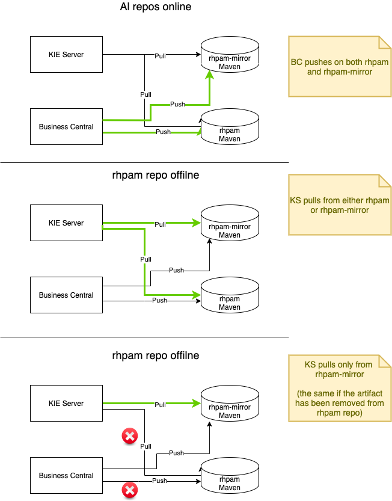

# Table of Contents
* [Configure RHPAM with External Maven Repo](#configure-rhpam-with-external-maven-repo)
  * [Install Maven repository on Nexus](#install-maven-repository-on-nexus)
    * [Testing locally](#testing-locally)  
  * [Populating Maven mirror](#populating-maven-mirror)  
  * [Deploying RHPAM application](#deploying-rhpam-application)
    * [Preliminary steps](#preliminary-steps)
    * [Validating the deployment](#validating-the-deployment)
    * [Test procedure](#test-procedure)
  * [Collateral: deploying the OriginationServiceTask custom task](#collateral-deploying-the-originationservicetask-custom-task)
  * [Troubleshooting](#troublehooting)
    * [Define log level in KIE Server container](#define-log-level-in-kie-server-container)

# Configure RHPAM with External Maven Repo
**Prerequisites**:
* Create new project `dmartino-maven`

This procedure is meant to deploy an instance of RHPAM with the following features:
* rhpam-authoring environment
* External Maven repository for both Business Central and KIE Server
  * Maven mirror configured for a restricted network environment
* KIE Server runs a Custom image generated from an additional custom extension
* KIE Server connects an external MS SQL database using an extension image

The following diagram shows the different use cases we want to validate with this procedure.


## Install Maven repository on Nexus
This step is optional in case you already have a company's repository for Maven2 artifacts.

* Install the `Nexus Operator` from `m88i Labs` on the OCP project
* Create a new `Nexus` instance from the operator page, with name `nexus3`, 'Use Red Hat Image' set to true and
`Persistent` set to true
* Launch the route named `nexus3` and connect the Nexus with credentials `admin/admin123'
* Refer to [How to upload the artifacts in Sonatype Nexus using Maven](https://www.devopsschool.com/blog/how-to-upload-the-artifacts-in-sonatype-nexus/)
to generate:
  * a new role `deploy` with privileges `nx-all`
  * a user `deployer/deployer123` with role `deploy`
  * [login as `deployer`]
  * a repository `rhpam` of type `maven2/hosted` with policy `Mixed`
  * a repository `rhpam-mirror` of type `maven2/hosted` with policy `Mixed`

### Testing locally
If you want to test the upload functionality on the Maven repository, add the following section to the Maven `settings.xml`
(customize the url to match the actual credentials):
```xml
<servers>
<server>
	<id>test-maven-release</id>
	<username>deployer</username>
	<password>deployer123</password>
</server>
<server>
	<id>test-maven-snapshot</id>
	<username>deployer</username>
	<password>deployer123</password>
</server>
</servers>
```

Then add the following section to the Maven `pom.xml` (customize the url to match the actual repos):
```xml
<distributionManagement>
	<repository>
		<id>rhpam</id>
		<name>Test Maven</name>
		<url>http://nexus3-dmartino-maven.apps.mw-ocp4.cloud.lab.eng.bos.redhat.com/repository/rhpam</url>
	</repository>
 
	<snapshotRepository>
		<id>rhpam</id>
		<name>Test Maven</name>
		<url>http://nexus3-dmartino-maven.apps.mw-ocp4.cloud.lab.eng.bos.redhat.com/repository/rhpam</url>
	</snapshotRepository>
</distributionManagement>
```
And finally, run `mvn deploy` on the Maven project and verify the result is deployed on the given repository.

## Populating Maven mirror
The following steps implement the procedure [2.11. PREPARING A MAVEN MIRROR REPOSITORY FOR OFFLINE USE](https://access.redhat.com/documentation/en-us/red_hat_process_automation_manager/7.11/html-single/deploying_red_hat_process_automation_manager_on_red_hat_openshift_container_platform/index#offline-repo-proc_openshift-operator)
that is required "if your Red Hat OpenShift Container Platform environment does not have outgoing access to the public Internet",
as per our requirements.

Visit the [Software Downloads](https://access.redhat.com/jbossnetwork/restricted/listSoftware.html?downloadType=distributions&product=rhpam&productChanged=yes)
page for `Process Automation Manager 7.11.0` and download the `Red Hat Process Automation Manager 7.11.0 Offliner Content List`,
e.g. `rhpam-7.11.0-offliner.zip`.

First, we prepare a POD with the minimum requirements (JDK11) to run the offline uploader and we move the downloaded 
archive on the newly created `offliner` pod:
```shell
oc run offliner --image openjdk/openjdk-11-rhel7 -- tail -f /dev/null
oc exec offliner -- mkdir /opt/offliner
oc rsync . offliner:/opt/offliner --exclude="*" --include=rhpam-7.11.0-offliner.zip
```

From the OCP administration console, open the `Terminal` page of the `offliner` Pod and execute the steps to initialize
the list of required artifacts and push them on the `rhpam-mirror` repository of Nexus. The repository is populated using
the [Maven Repository Provisioner](https://github.com/simpligility/maven-repository-tools/tree/master/maven-repository-provisioner) 
project:
```shell
cd /opt/offliner
unzip rhpam-7.11.0-offliner.zip
cd rhpam-7.11.0-offliner
# Note: replace 'wget' with 'curl -O'
./offline-repo-builder.sh offliner.txt

curl -O https://repo.maven.apache.org/maven2/com/simpligility/maven/maven-repository-provisioner/1.4.1/maven-repository-provisioner-1.4.1-jar-with-dependencies.jar
java --add-opens java.base/java.lang=ALL-UNNAMED \
  -jar maven-repository-provisioner-*-jar-with-dependencies.jar \
  -cd "repository" \
  -t "http://nexus3-dmartino-maven.apps.mw-ocp4.cloud.lab.eng.bos.redhat.com/repository/rhpam-mirror/" \
  -u deployer \
  -p deployer123
```

**Note**: you have to customize the above command if you are using a different URL or credentials for the external Maven
repository

## Deploying RHPAM application
### Preliminary steps
* Install the `Business Automation` operator
* From previous examples, perform these steps:
  * [Create secrets](../deployCustomJarOnOCP/README.md#create-secrets).
  * [Pushing the required images](../msSqlServerDatabase/README.md#pushing-the-required-images).
  * [Deploy MS SQL instance](../msSqlServerDatabase/README.md#deploy-ms-sql-instance)
  * [Create the RHPAM database and validate the MS SQL installation](../msSqlServerDatabase/README.md#create-the-rhpam-database-and-validate-the-ms-sql-installation)

**Note**: verify the current values of ${MSSQL_SERVICE_SERVICE_HOST} and ${MSSQL_SERVICE_SERVICE_PORT}
and update the `jdbcURL` property in [custom-rhpam-mssql-maven.yaml](./custom-rhpam-mssql-maven.yaml) in case
they have changed.

Customize the provided [custom-rhpam-mssql-maven.yaml](./custom-rhpam-mssql-maven.yaml) configuration to match your
requirements.

### Validating the deployment 
Launch the Route named `custom-rhpam-mssql-maven-rhpamcentr` (or `<KIEAPP-NAME>-rhpamcentr` if you are using a different 
name) and connect the instance using `admin/password` credentials.
Verify that you can design and deploy a new application and the artifacts are uploaded into the `rhpam` repository of the 
Nexus instance.

**Note**: include the below snippet of xml into any project that you want to export or push as a KJAR artifact to that external repository.
Follow the instructions at 
[2.4. Exporting a Business Central project to an external Maven repository](https://access.redhat.com/documentation/en-us/red_hat_process_automation_manager/7.11/html-single/deploying_and_managing_red_hat_process_automation_manager_services/index#maven-external-export-proc_packaging-deploying)
to locate the `pom.xml` file and add this before the end of the file:
```xml
<distributionManagement>
    <repository>
        <id>rhpam</id>
        <url>http://nexus3-dmartino-maven.apps.mw-ocp4.cloud.lab.eng.bos.redhat.com/repository/rhpam</url>
        <layout>default</layout>
    </repository>
</distributionManagement>
```

#### Test procedure
* Define an applicationin the `Business Central` console and install it to `rhpam` repo and then
  to `rhpam-mirror`, following above instructions
* Deploy the application on the single KIE Server instance and test it
* Undeploy the application
* Delete the artifact from the `rhpam` Nexus repo
* Deploy the application on the single KIE Server instance and test it: this time the mirror is used

## Troubleshooting
### Define log level in KIE Server container
* Open the `Terminal` for the KIE Server container 
* Execute `/opt/eap/bin/jboss-cli.sh` to launch the JBoss management CLI, then `connect`
* Use the following commands to set the log level to DEBUG for the `org.drools` logger:
```shell
/subsystem=logging/logger=org.drools:add
/subsystem=logging/logger=org.drools:write-attribute(name="level", value="DEBUG")
```
