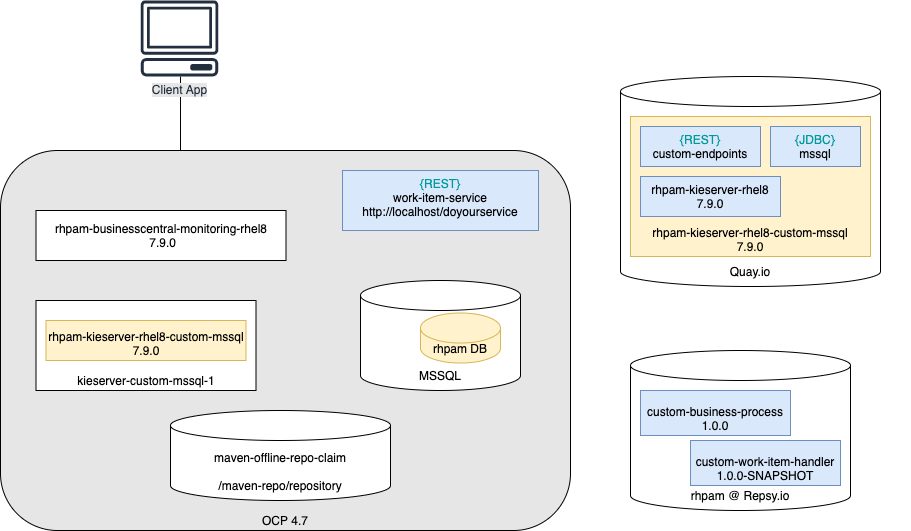

# Table of Contents

* [Maven repo using file system](#maven-repo-using-file-system)
  * [Deploy and initialize the PersistentVolume](#deploy-and-initialize-the-persistentvolume)
  * [Configure the KieApp deployment](#configure-the-kieapp-deployment)
  * [Deploying the KeiApp instance](#deploying-the-keiapp-instance)

# Maven repo using file system
The system architecture includes the same components as the [Repeatable process to create immutable image of KIE server](../repeatableProcess/OCP_README.md#deployment-architecture)
but the Maven mirror is not on `Repsy` but defined on a shared filesystem through `PersistentVolume`



On top of the configurations performed for the previous project, consider the following steps.

## Deploy and initialize the PersistentVolume
Execute these steps to create the `maven-offline-repo-claim` and populate the content with the required dependencies:
```shell
oc create -f offliner.yaml
```
This creates an `offliner` Pod that mounts the shared volume as `/maven-repo/`

Download from [Software Downloads](https://access.redhat.com/jbossnetwork/restricted/listSoftware.html?downloadType=distributions&product=rhpam&productChanged=yes)
page for `Process Automation Manager 7.9.0` the `Red Hat Process Automation Manager 7.9.0 Offliner Content List`,
e.g. [rhpam-7.9.0-offliner.zip](https://access.redhat.com/jbossnetwork/restricted/softwareDownload.html?softwareId=89611).
Run the following commands to initialize the offline Maven repository:

```shell
oc rsync . offliner:/opt/offliner --exclude="*" --include=rhpam-7.9.0-offliner.zip
oc rsh offliner
cd /opt/offliner
unzip rhpam-7.9.0-offliner.zip
cd rhpam-7.9.0-offliner
sed -i 's/wget/curl -O/g' offline-repo-builder.sh
./offline-repo-builder.sh offliner.txt
mv repository /maven-repo
```

**Note**: the `offliner` Pod mounts the shared volume as `/maven-repo` and stores the Maven repo as `/maven-repo/repository`

## Configure the KieApp deployment
In order to mount the PVC inside the KIE Server Pod, we need to manually edit the `ConfigMap` called `kieconfigs-7.11.1`
and apply the following updates:
* Add under servers.deploymentConfigs.spec.template.spec.containers[0].volumeMounts:
```yaml
                        - name: maven-offline-repo
                          mountPath: /maven-repo
```

* Add under servers.deploymentConfigs.spec.template.spec.volumes:
```yaml
                    - name: maven-offline-repo
                      persistentVolumeClaim:
                        claimName: maven-offline-repo-claim
```

* Add under servers.deploymentConfigs.spec.template.spec:
```yaml
                  securityContext:
                    supplementalGroups: [5555]
```

## Deploying the KeiApp instance
The given [custom-mssql-offline-maven.template](./custom-mssql-offline-maven.template) template defines the requested 
deployment, and used the following variable to configure the Maven mirror to use the shared filesystem:
```yaml
          - name: MAVEN_MIRROR_URL
            value: >-
              file:///maven-repo/repository
```

Run this command to set the actual route for the MS SQL DB instance:
```shell
sed "s/MSSQL_URL/`oc get svc mssql-service -o jsonpath="{..spec.clusterIP}:{..spec.ports[0].port}"`/g" \
custom-mssql-offline-maven.template > custom-mssql-offline-maven.yaml
```
Then you can create the deployment with:
```shell
oc create -f custom-mssql-offline-maven.yaml
```

The validation steps are the same as for the previous [Validation procedure](../repeatableProcess/OCP_README.md#validation-procedure)

**Troubleshooting Notes**: please be aware of the `securityContext` settings in the `offliner` Pod and in the `KieApp` 
deployment configuration. They must have the same values to let the KIE Server applications access the shared filesystem