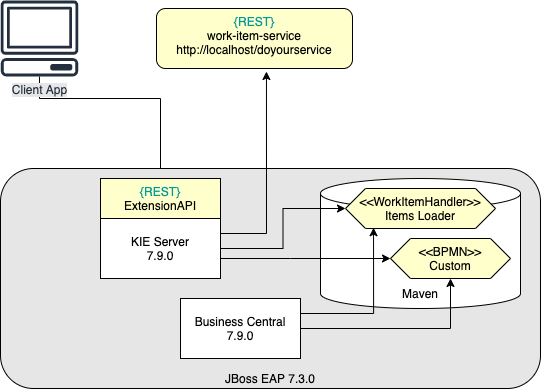
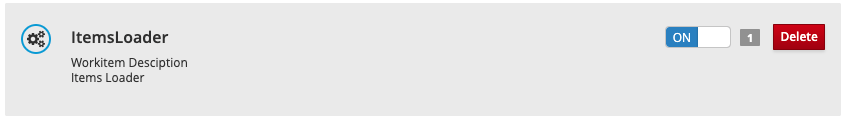
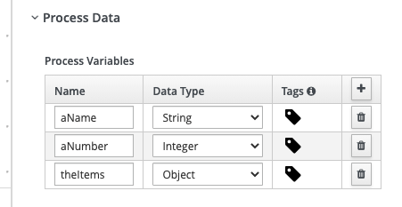
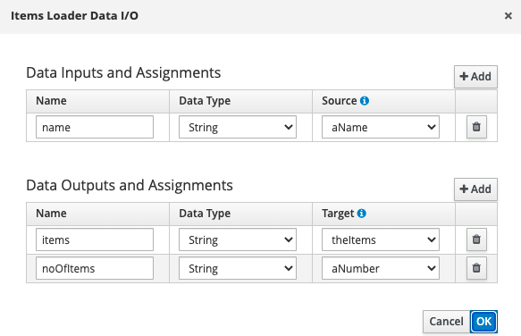
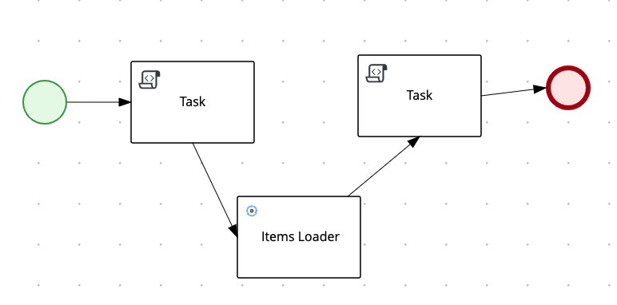
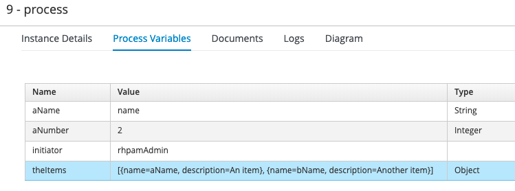
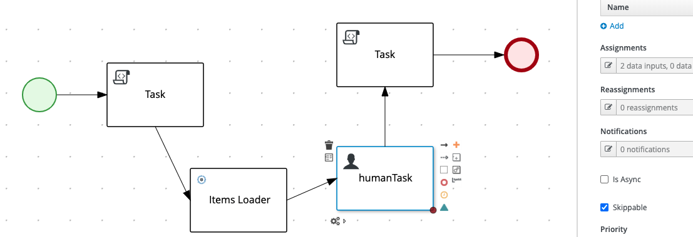
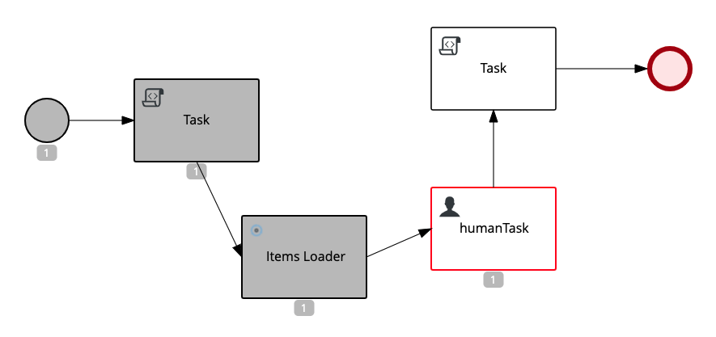

# Table of Contents

* [Phase 1: deploying on JBoss EAP](#phase-1-deploying-on-jboss-eap)
  * [Deploying RHPAM](#deploying-rhpam)
  * [Starting the `work-item-service` REST Service](#starting-the-work-item-service-rest-service)
  * [Design the `Items Loader` WorkItemHandler](#design-the-items-loader-workitemhandler)
  * [Build the `Items Loader` WorkItemHandler](#build-the-items-loader-workitemhandler)
  * [Install the `Items Loader` WorkItemHandler](#install-the-items-loader-workitemhandler)
  * [Develop, deploy and test the `Custom Project`](#develop-deploy-and-test-the-custom-project)
  * [Develop, deploy and test the Extension API](#develop-deploy-and-test-the-extension-api)
* [Troubleshooting](#troubleshooting) 
  * [Track Extension API log messages](#track-extension-api-log-messages)

## Phase 1: deploying on JBoss EAP
This picture illustrates the deployment architecture of the ibitial solution:
* JBoss EAP hosts RHPAM version 7.9.0
* The default KIE Server is enhanced with extended API endpoints  
* A Quarkus application `work-item-service` is developed to expose REST API
* An `Items Loader` implementation of the `WorkItemHandler` is developed to invoke the endpoints of `work-item-service`
* A business process is designed to include the `Items Loader` handler



### Deploying RHPAM 
* Download JBoss EAP and RHPAM following this link: [Prerequisite Downloads](https://github.com/rhkp/temenos-build-standalone-rhpam/tree/main/rhpam-setup#prerequisite-downloads)
* Then install JBoss EAP and RHPAM following the link on the same page
  * Note: there is no need to setup any custom DB, the default settings are sufficient
* Edit the file in JBOSS_HOME/standalone/configuration/standalone-full.xml and add the following under the `<system-properties>`
  node:
```xml
<property name="kie.maven.offline.force" value="true"/>
```  
* Start JBoss EAP following the instructions on the same page
    
### Starting the `work-item-service` REST Service
Starting from the current folder, run these commands to start the `work-item-service` REST Service:

```shell
cd work-item-service
mvn quarkus:dev
```

This application exposes two APIs at `localhost:8080/doyourservice`:
* GET: returns a list of Item instances, with name and description properties
* POST: adds a new Item to the list
Example of response to a GET request:
```json
[
  {
    "name": "aName",
    "description": "A service"
  }
]
```

**Note**: use any REST client of your choice (e.g., [Postman](https://www.postman.com/downloads/)) to populate the service 
with some initial data.

### Design the `Items Loader` WorkItemHandler
**References**:
* [CUSTOM TASKS AND WORK ITEM HANDLERS IN BUSINESS CENTRAL](https://access.redhat.com/documentation/en-us/red_hat_process_automation_manager/7.5/html-single/custom_tasks_and_work_item_handlers_in_business_central/index)

Following are the steps to develop the sample project. 
The code is already available on the `custom-work-item-handler` folder, ready
for being compiled: please skip to the next section in case you are not interested.

First, we create the initial project with:
```shell
mvn archetype:generate \
  -DarchetypeGroupId=org.jbpm \
  -DarchetypeArtifactId=jbpm-workitems-archetype \
  -DarchetypeVersion=7.44.0.Final-redhat-00003 \
  -Dversion=1.0.0-SNAPSHOT \
  -DgroupId=com.redhat.ecosystem.appeng.fsi \
  -DartifactId=custom-work-item-handler \
  -DclassPrefix=ItemsLoader
```

**Note*: the value of `archetypeVersion` comes from [What is the mapping between Red Hat Process Automation Manager and the Maven library version?](https://access.redhat.com/solutions/3405361)
Define a custom [settings.xml](./custom-work-item-handler/settings.xml) to define the reference to the `redhat-ga` repository
to download the required dependencies

You can inspect the sample implementation of the WorkItemHandler class in [ItemsLoaderWorkItemHandler.java](./custom-work-item-handler/src/main/java/com/redhat/ecosystem/appeng/fsi/ItemsLoaderWorkItemHandler.java)

### Build the `Items Loader` WorkItemHandler
The following command generates the required artifact under the `target` folder:
```shell
mvn -s settings.xml clean package
```

### Install the `Items Loader` WorkItemHandler
From the [Business Central console](http://localhost:8080/business-central), follow these steps:
* From `Admin>Custom Tasks Administration`, select `Add Custom Task`
  * Select the generated jar under the `target` folder and then `Upload`
  * Note: the jar is then deployed in `JBOSS_HOME/repositories/kie/global/com/redhat/ecosystem/appeng/fsi/custom-work-item-handler`
  * Activate the handler moving the switch to ON:

    
### Develop, deploy and test the `Custom Project`
You can create your own project in Business Central, please follow these rules to properly integrate the newly deployed 
WorkItemHandler:
* From project Settings, open the `Custom Tasks` page and select `Install` for the 'Items Loader' task
* Create at least one asset of type `BusinessProcess` and include the `ItemsLoader` element in the flow
* The process should have some variables to store the return value of the `Items Loader` execution:

  
* Create some `Data Assignments` to the `Items Loader` to map I/O parameters to the process variables:


* The overall flow has been validated with the following business process:



Once the project is built and deployed, you can run it from the `Process Instances` page.
If the execution succeeds, the detailed page for the given process instance shows the values of hte process variables: 



### Develop, deploy and test the Extension API

**Requirements**:
* Have one API endpoint that returns the metadata of a given running task:

&nbsp;&nbsp;&nbsp;&nbsp;`GET extension/custom-api/{containerId}/{taskInstanceId}`

&nbsp;&nbsp;&nbsp;&nbsp;Metadata includes the common task properties, including `task-skippable`

* Have one API endpoint to skip the execution of a given running task:
 
&nbsp;&nbsp;&nbsp;&nbsp;`PUT extension/custom-api/{containerId}/{taskInstanceId}/skip`

The reference implementation given in the [custom-endpoints](./custom-endpoints) folder, extends the `BPM/jBPM` capabilities 
based on the reference documentation [22.1. Extending an existing KIE Server capability with a custom REST API endpoint](https://access.redhat.com/documentation/en-us/red_hat_process_automation_manager/7.9/html-single/managing_red_hat_process_automation_manager_and_kie_server_settings/index#kie-server-extensions-endpoint-proc_execution-server)
and on the sample implementations of [UserTaskResource](https://github.com/kiegroup/droolsjbpm-integration/blob/7.44.0.Final/kie-server-parent/kie-server-remote/kie-server-rest/kie-server-rest-jbpm/src/main/java/org/kie/server/remote/rest/jbpm/UserTaskResource.java) and
[JbpmRestApplicationComponentsService](https://github.com/kiegroup/droolsjbpm-integration/blob/762c1570f96d9d5826ea1cb34027b55ac77f1b2b/kie-server-parent/kie-server-remote/kie-server-rest/kie-server-rest-jbpm/src/main/java/org/kie/server/remote/rest/jbpm/JbpmRestApplicationComponentsService.java)
to generate an artifact that can be installed on the KIE Server with the following commands:
```shell
cd custom-endpoints
mvn -s ../custom-work-item-handler/settings.xml clean package
cp target/custom-endpoints-1.0.0-SNAPSHOT.jar ~/tools/EAP-7.3.0/standalone/deployments/kie-server.war/WEB-INF/lib/custom-endpoints-1.0.0-SNAPSHOT.jar
cd JBOSS_HOME/bin
./jboss-cli.sh --connect --command=shutdown
./standalone.sh -c standalone-full.xml
```
Once the server is successfully started, you can extend the initial business process by adding a Human Task to suspend the 
process instance after the initial execution:

Please note that the human task is marked as a `Skippable` task.

Once the process instance has started, it stops on the human task:


By running the extension APIs, we can read the current status of the task and skip its execution.
You can test the entire flow using the sample REST queries and actions provided in the given [Postman collection scripts](./custom-endpoints/RHPAM-extensionAPI.postman_collection.json)

**References**:
* [Chapter 22. KIE Server capabilities and extensions](https://access.redhat.com/documentation/en-us/red_hat_process_automation_manager/7.9/html-single/managing_red_hat_process_automation_manager_and_kie_server_settings/index#kie-server-extensions-con_execution-server)
* [Swagger API](http://localhost:8080/kie-server/docs/)
* [INTERACTING WITH RED HAT PROCESS AUTOMATION MANAGER USING KIE APIS](https://access.redhat.com/documentation/en-us/red_hat_process_automation_manager/7.8/html-single/interacting_with_red_hat_process_automation_manager_using_kie_apis/index)

# Troubleshooting
## Track Extension API log messages
Check the endpoint has bee properly deployed:
```shell
cd JBOSS_HOME/standalone/logs
grep CustomApplicationComponentsService server.log
```
```text
2021-07-29 14:52:36,656 INFO  [com.redhat.ecosystem.appeng.fsi.CustomApplicationComponentsService] (ServerService Thread Pool -- 84) Invoked getAppComponents with: jBPM/REST
2021-07-29 14:52:36,658 INFO  [com.redhat.ecosystem.appeng.fsi.CustomApplicationComponentsService] (ServerService Thread Pool -- 84) Invoked getAppComponents. Returning: [com.redhat.ecosystem.appeng.fsi.CustomResource@3e1c4d6f]
```

Verify the endpoint is working:
```shell
grep CustomResource server.log
```

```text
2021-07-29 14:42:16,189 INFO  [com.redhat.ecosystem.appeng.fsi.CustomResource] (default task-6) Getting task 1 of container CustomProject_1.0.0-SNAPSHOT 
2021-07-29 14:42:16,243 INFO  [com.redhat.ecosystem.appeng.fsi.CustomResource] (default task-6) Returning task content '{ 
2021-07-29 14:42:27,737 INFO  [com.redhat.ecosystem.appeng.fsi.CustomResource] (default task-6) Skipping task 1 of container CustomProject_1.0.0-SNAPSHOT
2021-07-29 14:42:27,800 INFO  [com.redhat.ecosystem.appeng.fsi.CustomResource] (default task-6) Task skipped
```

# Backup commands 
**WIP**
# 2.9. Extracting the source code from Business Central for use in an S2I build
[2.9. Extracting the source code from Business Central for use in an S2I build](https://access.redhat.com/documentation/en-us/red_hat_process_automation_manager/7.11/html-single/deploying_red_hat_process_automation_manager_on_red_hat_openshift_container_platform/index#environment-immutable-source-extract-proc_openshift-operator)

```shell
env GIT_SSL_NO_VERIFY=true \
  git clone --depth 1 ssh://rhpamAdmin@localhost:8001/testSpace/custom
```

Command to copy local dependencies under `target/dependency` folder, in repository layout:
```shell
mvn dependency:copy-dependencies -s settings.xml -Dmdep.useRepositoryLayout
```


