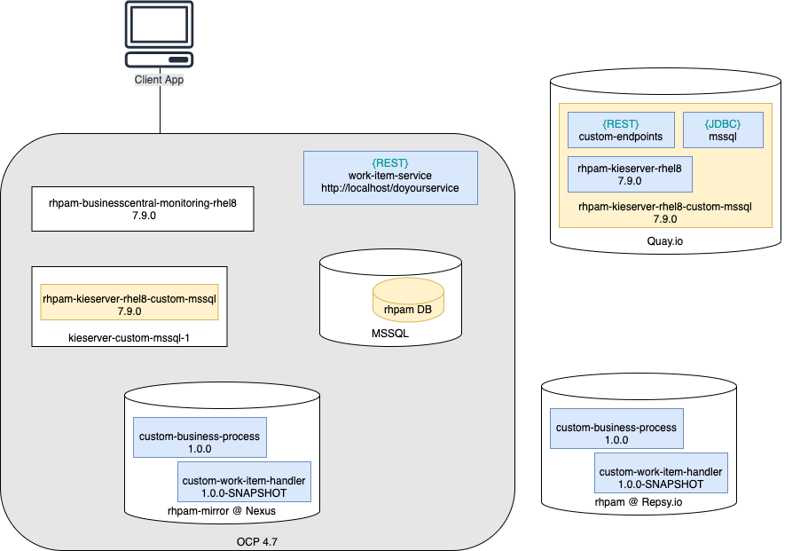

# Table of Contents

* [Phase 2: deploying on OCP](#phase-2-deploying-on-ocp)
  * [Updates from existing procedures](#updates-from-existing-procedures)
  * [Deployment architecture](#deployment-architecture)
  * [Configuring SSO Authentication](#configuring-sso-authentication)
  * [Configuring Maven repositories](#configuring-maven-repositories)
    * [External Maven repository on Repsy](#external-maven-repository-on-repsy)
    * [Maven mirror on OCP](#maven-mirror-on-ocp)
  * [Custom KIE Server image](#custom-kie-server-image)
      * [Building the required artifacts](#building-the-required-artifacts)
      * [Building the custom KIE Server image with Podman on MacOS](#building-the-custom-kie-server-image-with-podman-on-macos)
  * [Configuring the MS SQL database](#configuring-the-ms-sql-database)
    * [Deploying the MS SQL instance](#deploying-the-ms-sql-instance)
  * [Deploying RHPAM on OCP](#deploying-rhpam-on-ocp)
    * [Deploying the KeiApp instance](#deploying-the-keiapp-instance)
  * [Validation procedure](#validation-procedure)
    * [Deploy work-item-service on OCP](#deploy-work-item-service-on-ocp)
    * [Verify the custom artifacts are installed](#verify-the-custom-artifacts-are-installed)
    * [Verify the MS SQL driver is installed](#verify-the-ms-sql-driver-is-installed)
    * [Deploy the example Business Process](#deploy-the-example-business-process)
    * [Validate the extension REST API](#validate-the-extension-rest-api)

# Phase 2: deploying on OCP
## Updates from existing procedures
* Secrets are not deployed on OCP because RHPAM is not publihing HTTPS services
* Reference version is 7.9.0, which affects all the different parts involved with the deployment (Maven, MS SQL)
* Maven repo is configured on Repsy
* Nexus is deployed from official operator provided by Sonatype

## Deployment architecture
The system architecture includes the following components:
* KIE Server from custom image:
  * Base version in [7.9.0](https://catalog.redhat.com/software/containers/rhpam-7/rhpam-kieserver-rhel8/5db03b6cbed8bd164af2a202?tag=7.9.0-7&push_date=1604604575000&container-tabs=overview&gti-tabs=registry-tokens)
  * Including custom API endpoints
  * Including MS SQL driver
  * Pushed on [Quay.io](https://quay.io/) registry
* External Maven artifacts repository on [Repsy.io](https://repsy.io/)
* Maven mirror created from a Nexus instance deployed in OCP
* SSO Authentication managed by Keycloack
* Test REST API

The following picture describes the above components:


## Configuring SSO Authentication
Follow these [instructions](../rhpamWithSSO#installation-and-configuration-of-rhsso) to depliy the `Keycloak`
instance and configure the realm for the RH PAM deployment.
**Note**: following configuration files assumes these settings have been configured:
* Realm name is `demo`
* RHPAM user name is `adminuser`
* RHPAM user password is `password`
* Business Central client ID is `businesscentral`
* KIE Server client ID is `kieserver`

**Note**: Once you configured all the authentication parts, you must replace the `objects.console.ssoClient.secret` and
`objects.servers[0].ssoClient.secret` with the actual secrets that are available from the Kaycloack console for the
associated clients.

## Configuring Maven repositories
### External Maven repository on Repsy
Register a free account on [Repsy](https://repsy.io/) and create a Maven repository called `rhpam`.
Our reference repository is defined for user `dmartino/dMartino123` at the URL `https://repo.repsy.io/mvn/dmartino/rhpam`.

### Maven mirror on OCP
The following instructions provision the required Maven repository on a Nexus instance deployed on OCP:
* Install the `Nexus Repository Operator  3.32.0-1 provided by Sonatype` on the OpenShift project
* Click on the operator and create a new `NexusRepo` instance named `rhpam-mirror`
* Launch the route named `rhpam-mirror` and connect the Nexus with credentials `admin/admin123`
* Refer to [How to upload the artifacts in Sonatype Nexus using Maven](https://www.devopsschool.com/blog/how-to-upload-the-artifacts-in-sonatype-nexus/)
  to generate:
  * a new role `deploy` with privileges `nx-all`* a user `deployer/deployer123` with role `deploy`
  * [login as `deployer`]
  * a repository `rhpam-mirror790` of type `maven2/hosted` with policy `Mixed`

**Note**: the mirror repository must be publicly accessible:
```text
The repository must allow read access without authentication
```
This can be achieved by enabling the following setting in the Nexus instance:
`Settings>Anonymous Access>Allow anonymous users to access the server`

The mirror repository is then populated with all the required dependencies, starting from the [Software Downloads](https://access.redhat.com/jbossnetwork/restricted/listSoftware.html?downloadType=distributions&product=rhpam&productChanged=yes)
page for `Process Automation Manager 7.9.0`, where we can download the `Red Hat Process Automation Manager 7.9.0 Offliner Content List`,
e.g. [rhpam-7.9.0-offliner.zip](https://access.redhat.com/jbossnetwork/restricted/softwareDownload.html?softwareId=89611).
Run the following commands to setup a Pod that runs the repository population procedure:
```shell
oc run offliner --image openjdk/openjdk-11-rhel7 -- tail -f /dev/null
oc exec offliner -- mkdir /opt/offliner
oc rsync . offliner:/opt/offliner --exclude="*" --include=rhpam-7.9.0-offliner.zip
```
From the OCP administration console, open the `Terminal` page of the `offliner` Pod and execute the steps to initialize
the list of required artifacts and push them on the `rhpam-mirror790` repository of Nexus. The repository is populated using
the [Maven Repository Provisioner](https://github.com/simpligility/maven-repository-tools/tree/master/maven-repository-provisioner)
project:
```shell
cd /opt/offliner
unzip rhpam-7.9.0-offliner.zip
cd rhpam-7.9.0-offliner
# Note: replace 'wget' with 'curl -O'
sed -i 's/wget/curl -O/g' offline-repo-builder.sh
./offline-repo-builder.sh offliner.txt

curl -O https://repo.maven.apache.org/maven2/com/simpligility/maven/maven-repository-provisioner/1.4.1/maven-repository-provisioner-1.4.1-jar-with-dependencies.jar
java --add-opens java.base/java.lang=ALL-UNNAMED \
  -jar maven-repository-provisioner-*-jar-with-dependencies.jar \
  -cd "repository" \
  -t "http://rhpam-mirror-dmartino-immutable.apps.mw-ocp4.cloud.lab.eng.bos.redhat.com/repository/rhpam-mirror790" \
  -u deployer \
  -p deployer123
```

## Custom KIE Server image
### Building the required artifacts
The following commands build all the required artifacts and deploy them on the Maven repository and mirror:
* [custom-endpoints](./custom-endpoints): the custom extension API to integrate in the KIE Server image
  * Note: this artifact is not deployed on the Maven repository
* [custom-work-item-handler](./custom-work-item-handler): the custom `WorkItemHandler` exposing the `ItemsLoader` item
  * Note: you have to update the URL in `ItemsLoaderWorkItemHandler.java` to point to the actual route of the
`work-item-service` deployment
* [work-item-service](./work-item-service): the example REST API queried by the `ItemsLoader` item
  * Note: this artifact is not deployed on the Maven repository
* [custom-business-project](./custom-business-project): the custom Business Process using the `Items Loader` item (this was 
pulled from the initial [EAP deployment](./EAP_README.md) using `git clone ssh://rhpamAdmin@localhost:8001/testSpace/custom`)

```shell
mvn -s settings.xml clean package deploy
mvn -s settings.xml deploy -Dmirror
```

### Building the custom KIE Server image with Podman on MacOS
* Copy the artifact generated for the [custom-endpoints](./custom-endpoints) project:
```shell
cp custom-endpoints/target/custom-endpoints-1.0.0-SNAPSHOT.jar ../msSqlServerDatabase
cd ../msSqlServerDatabase
```
* Then follow the instructions defined [here](../msSqlServerDatabase/README.md#build-and-push-the-custom-kie-server-image)
to build the KIE Server image including the custom extension API and the MSSQL driver to [Quay](https://quay.io/repository/ecosystem-appeng/rhpam-kieserver-rhel8-custom?tab=tags)

## Configuring the MS SQL database
### Deploying the MS SQL instance
**Note**: These steps are optional if you already have your own running instance of MS SQL server (either as an OpenShift
container or as a standalone service).

* [Deploy MS SQL instance](../msSqlServerDatabase/README.md#deploy-ms-sql-instance)
* [Create the RHPAM database and validate the MS SQL installation](../msSqlServerDatabase/README.md#create-the-rhpam-database-and-validate-the-ms-sql-installation)

## Deploying RHPAM on OCP
### Deploying the KeiApp instance
**Prerequisites**:
* Install the `Business Automation` operator

The reference YAML configuration template [custom-rhpam-mssql-maven.template](./custom-rhpam-mssql-maven.template) defines the `KieApp` 
instance for the RHPAM application, with the following features:
* Environment: `rhpam-production`
* Base images: 7.9.0
* KIE Server:
  * Custom image `rhpam-kieserver-rhel8-custom-mssql`  with `custom-endpoints` extension API and MS SQL driver
  * 1 replica
* Business Central:
  * 1 replica
* External Maven repository `rhpam` on Repsy
* Mirror Maven repository `rhpam-mirror` on OCP
* MS SQL database
* No `Smart Router`

You can use this file as a reference to configure your instance. In particular, if you use your own DB instance, look at
properties in the `database.externalConfig` section, to connect it to your exact MS SQL instance.
**Note**: if you pushed the custom image on a different repository or with a different name, you might updated the
`image`, `imageContext` and `imageTag` properties to match your actual configuration.

Before deploying the application we must provide the secret to login to Quay, as described [here](../deployCustomJarOnOCP/README.md#authenticate-the-quayio-registry):
```shell
oc create -f quay.io-secret.yaml
QUAYIO_SECRET_NAME=$(grep name quay.io-secret.yaml | sed -e 's/.*: //')
oc secrets link default ${QUAYIO_SECRET_NAME} --for=pull
oc secrets link builder ${QUAYIO_SECRET_NAME} --for=pull
```
The following commands push on the Quay registry the base image for the Business Central Monitoring of the re required version 7.9.0:
```shell
podman pull registry.redhat.io/rhpam-7/rhpam-businesscentral-monitoring-rhel8:7.9.0
podman tag registry.redhat.io/rhpam-7/rhpam-businesscentral-monitoring-rhel8:7.9.0 \
  quay.io/ecosystem-appeng/rhpam-businesscentral-monitoring-rhel8:7.9.0
podman push quay.io/ecosystem-appeng/rhpam-businesscentral-monitoring-rhel8:7.9.0
```

If you are using the MS SQL instance described above, you need to generate the actual YAML configuration starting from the
reference [custom-rhpam-mssql-maven.template](./custom-rhpam-mssql-maven.template) template.
The following command sets the actual URL connection of the MS SQL deployment:
```shell
sed "s/MSSQL_URL/`oc get svc mssql-service -o jsonpath="{..spec.clusterIP}:{..spec.ports[0].port}"`/g" \
  custom-rhpam-mssql-maven.template > custom-rhpam-mssql-maven.yaml
```

**Note**: you must first update the template file with the actual SSO secrets as described [here](#configuring-sso-authentication)

Finally, we can deploy the sample application with:
```shell
oc create -f custom-rhpam-mssql-maven.yaml
```

**Note**: you might need to update the given [custom-rhpam-mssql-maven.template](./custom-rhpam-mssql-maven.template) configuration to
adapt the environment parameters to match your actual setup (e.g., Maven and MS SQL location, OCP namespace and so on)

## Validation procedure
### Deploy work-item-service on OCP
Run the following commands to deploy the sample REST API `work-item-service` on the OCP platform:
```shell
cd work-item-service
mvn quarkus:add-extension -Dextensions="openshift"
mvn clean package -Dquarkus.kubernetes.deploy=true
```

**Note**: The following settings are required in `application.properties`:
```properties
quarkus.openshift.expose=true
quarkus.kubernetes-client.trust-certs=true
```

### Verify the custom artifacts are installed
The following commands verify the proper installation of the `custom-endpoints` extension API and checks there are no
errors in the log of the Pod:
```shell
oc exec `oc get pods | grep kieserver-custom | grep Running | awk '{print $1}'` \
  -- ls /opt/eap/standalone/deployments/ROOT.war/WEB-INF/lib/custom-endpoints-1.0.0-SNAPSHOT.jar
oc logs `oc get pods | grep kieserver-custom | grep Running | awk '{print $1}'` | grep CustomApplicationComponentsService
```

### Verify the MS SQL driver is installed
The following commands verify the proper installation of the MS SQL driver in the KIE Server Pod:
```shell
oc exec -it `oc get pods | grep kieserver-custom | grep Running | awk '{print $1}'` -- ls /opt/eap/modules/com/microsoft/main
```

### Deploy the example Business Process
From the `Business Central Monitor` application available for the route `custom-rhpam-mssql-maven-rhpamcentrmon` (`adminuser/password`),
go to `Execution Servers` and add a new `Deployment Unit` with these settings:
```text
Name: CustomProject
Group Name: com.testspace
Artifact Id: CustomProject
Version: 1.0.0
```
Verify the deployment unit has no errors on the console and by monitoring the log file:
```shell
oc logs -f `oc get pods | grep kieserver-custom | grep Running | awk '{print $1}'` 
```

Then, start a new  `Process Instance`, selecting the `custom.process` process.
Once started, open the instance and verify the `Process Variables` tab contains the expected values for every variable.
Finally, open the `Process Diagram` tab and verify that the process is waiting on ythe `humanTask` task. 

### Validate the extension REST API
You can use the attached [Postman collection scripts](./custom-endpoints/RHPAM-extensionAPI.postman_collection.json) to 
validate the extension REST APIs, or to serve as a reference and adopt your own REST client.

This suite can populate automatically the required URL parameters for you, given that there is only one deployment unit
on the KIE Server and only one active process:
* Create one `Environment` in Postman with the following variables:
  * `kieserver-url` taken from the location of the `kieserver-custom-mssql` route exposed in OCP
  * `scheme` which is usually `https` for OCP deployments and `http` for local/EAP deployments
* Run the `Get containers` request to load the `containerId` parameter (should be `CustomProject`, if you followed the above instructions)
* Run the `Get process instance` request to load the `processInstanceId` parameter
* Run the `Get instance details` request to load the `taskInstanceId` parameter
* Finally, run the `Custom getTask` and `Custom skip` requests to load the metadata of the given task and to skip the execution

Once completed, go back to the `Process Diagram` tab and verify that the whole process has completed the execution.