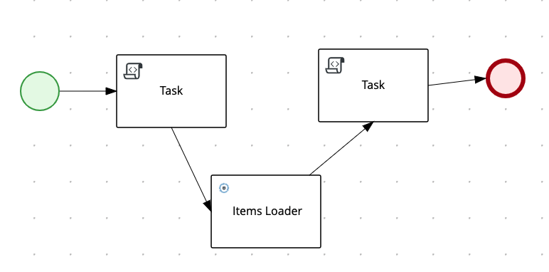

# Repeatable process to create immutable image of KIE server

## Phase 1: deployment on JBoss EAP
This picture illustrates the deployment architecture of the ibitial solution:
* JBoss EAP hosts RHPAM version 7.9.0
* The default KIE Server is enhanced with extended API endpoints  
* A Quarkus application `work-item-service` is developed to expose REST API
* An `Items Loader` implementation of the `WorkItemHandler` is developed to invoke the endpoints of `work-item-service`
* A business process is designed to include the `Items Loader` handler


### Deploying RHPAM 
* Download JBoss EAP and RHPAM following this link: [Prerequisite Downloads](https://github.com/rhkp/temenos-build-standalone-rhpam/tree/main/rhpam-setup#prerequisite-downloads)
* Then install JBoss EAP and RHPAM following the link on the same page
  * Note: there is no need to setup any custom DB, the default settings are sufficient
* Edit the file in JBOSS_HOME/standalone/configuration/standalone-full.xml and add the following under the `<system-properties>`
  node:
```xml
<property name="kie.maven.offline.force" value="true"/>
```  
* Start JBoss EAP following the instructions on the same page
    
## Starting the `work-item-service` REST Service
Starting from the current folder, run these commands to start the `work-item-service` REST Service:

```shell
cd work-item-service
mvn quarkus:dev
```

This application exposes two APIs at `localhost:8080/doyourservice`:
* GET: returns a list of Item instances, with name and description properties
* POST: adds a new Item to the list
Example of response to a GET request:
```json
[
  {
    "name": "aName",
    "description": "A service"
  }
]
```

**Note**: use any REST client of your choice (e.g., [Postman](https://www.postman.com/downloads/)) to populate the service 
with some initial data.

### Design the `Items Loader` project
**References**:
* [CUSTOM TASKS AND WORK ITEM HANDLERS IN BUSINESS CENTRAL](https://access.redhat.com/documentation/en-us/red_hat_process_automation_manager/7.5/html-single/custom_tasks_and_work_item_handlers_in_business_central/index)

Following are the steps to develop the sample project. 
The code is already available on the `custom-work-item-handler` folder, ready
for being compiled: please skip to the next section in case you are not interested.

First, we create the initial project with:
```shell
mvn archetype:generate \
  -DarchetypeGroupId=org.jbpm \
  -DarchetypeArtifactId=jbpm-workitems-archetype \
  -DarchetypeVersion=7.44.0.Final-redhat-00003 \
  -Dversion=1.0.0-SNAPSHOT \
  -DgroupId=com.redhat.ecosystem.appeng.fsi \
  -DartifactId=custom-work-item-handler \
  -DclassPrefix=ItemsLoader
```

**Note*: the value of `archetypeVersion` comes from [What is the mapping between Red Hat Process Automation Manager and the Maven library version?](https://access.redhat.com/solutions/3405361)
Define a custom [settings.xml](./custom-work-item-handler/settings.xml) to define the reference to the `redhat-ga` repository
to download the required dependencies

You can inspect the sample implementation of the WorkItemHandler class in [ItemsLoaderWorkItemHandler.java](./custom-work-item-handler/src/main/java/com/redhat/ecosystem/appeng/fsi/ItemsLoaderWorkItemHandler.java)

### Build the `Items Loader` artifact
The following command generates the required artifact under the `target` folder:
```shell
mvn -s settings.xml clean package
```

### Install the `Items Loader` WorkItemHandler
From the [Business Central console](http://localhost:8080/business-central), follow these steps:
* From `Admin>Custom Tasks Administration`, select `Add Custom Task`
  * Select the generated jar under the `target` folder and then `Upload`
  * Note: the jar is then deployed in `JBOSS_HOME/repositories/kie/global/com/redhat/ecosystem/appeng/fsi/custom-work-item-handler`
  * Activate the handler moving the switch to ON:

    
### Develop, deploy and test the `Custom Project`
You can create your own project in Business Central, please follow these rules to properly integrate the newly deployed 
WorkItemHandler:
* From project Settings, open the `Custom Tasks` page and select `Install` for the 'Items Loader' task
* Create at least one asset of type `BusinessProcess` and include the `ItemsLoader` element in the flow
* The process should have some variables to store the return value of the `Items Loader` execution:

  
* Create some `Data Assignments` to the `Items Loader` to map I/O parameters to the process variables:


* The overall flow we have validated is the following



Once the project is built and deployed, you can run it from the `Process Instances` page.
If the execution succeeds, the detailed page for the given process instance shows the values of hte process variables: 


# Backup commands **WIP**
# 2.9. Extracting the source code from Business Central for use in an S2I build
[2.9. Extracting the source code from Business Central for use in an S2I build](https://access.redhat.com/documentation/en-us/red_hat_process_automation_manager/7.11/html-single/deploying_red_hat_process_automation_manager_on_red_hat_openshift_container_platform/index#environment-immutable-source-extract-proc_openshift-operator)

```shell
env GIT_SSL_NO_VERIFY=true \
  git clone --depth 1 ssh://rhpamAdmin@localhost:8001/testSpace/custom
```

Command to copy local dependencies under `target/dependency` folder, in repository layout:
```shell
mvn dependency:copy-dependencies -s settings.xml -Dmdep.useRepositoryLayout
```


