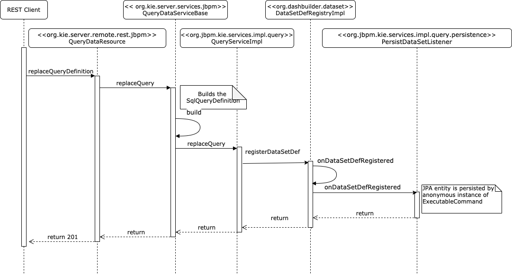
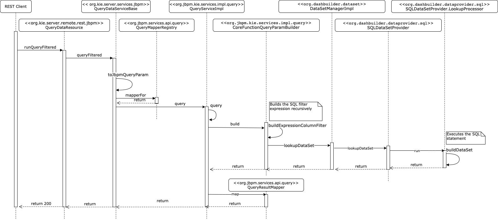

# Table of Contents
* [Custom query registration](#custom-query-registration)
* [Custom query execution (with filter)](#custom-query-execution-with-filter)

# Custom query registration
* URL invoked is (PUT) `http://localhost:8080/kie-server/services/rest/server/queries/definitions/my-jbpmProcessInstancesWithVariables`
* HTTP header `Content-type` is `application/json`
* Body is:
```json
{
  "query-name": "my-jbpmProcessInstancesWithVariables",
  "query-source": "${org.kie.server.persistence.ds}",
  "query-expression": "select vil.processInstanceId, vil.processId, vil.id, vil.variableId, vil.value from VariableInstanceLog vil where vil.id in (select MAX(v.id) from VariableInstanceLog v group by v.variableId, v.processInstanceId)",
  "query-target": "CUSTOM",
  "query-columns": {
    "processInstanceId": "NUMBER",
    "processId": "LABEL",
    "id": "NUMBER",
    "variableId": "LABEL",
    "value": "LABEL"
  }
}
```

Sequence diagram with main internal interactions:



# Custom query execution (with filter)
* URL invoked is (POST) `http://localhost:8080/kie-server/services/rest/server/queries/definitions/my-jbpmProcessInstancesWithVariables/filtered-data?mapper=RawList`
* HTTP header `Content-type` is `application/json`
* `mapper` parameter is set to `RawList`: this returns a flat array of column values for each fetched row
* Body is:
```json
{
  "order-by" : "processinstanceid",
  "order-asc" : false,
  "query-params" : [ {
    "cond-column" : "processinstanceid",
    "cond-operator" : "GREATER_THAN",
    "cond-values" : [ 9 ]
  } ],
  "result-column-mapping" : null,
  "order-by-clause" : null}
```

Sequence diagram with main internal interactions:



The execution runs the following query:
```sql
SELECT processInstanceId, processId, id, variableId, value FROM 
    (select vil.processInstanceId, vil.processId, vil.id, vil.variableId, vil.value from VariableInstanceLog vil where
        vil.id in 
            (select MAX(v.id) from VariableInstanceLog v group by v.variableId, v.processInstanceId)) AS `dbSQL` 
    WHERE processInstanceId > 9 ORDER BY processInstanceId DESC LIMIT 10
```

(found with breakpoint in `org.dashbuilder.dataprovider.sql.SQLDataSetProvider.LookupProcessor.run`, read the value of
`_query` instance field)